# CNNVD登录

> 网站地址： aHR0cHM6Ly93d3cuY25udmQub3JnLmNuL2xvZ2lu  
>
> https://github.com/Guapisansan/gpss_learn_reverse 代码在这里，会持续更新逆向案例

**免责声明： 此文档，以及脚本，仅用来对技术的学习与探讨，如有冒犯，请联系作者电话，微信13933566015进行删除**

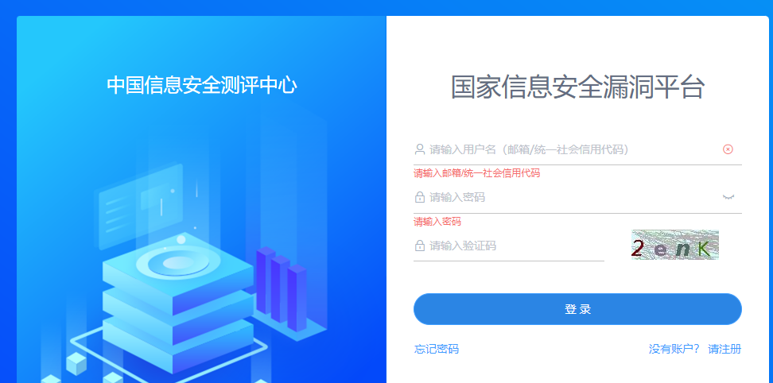

对这个cnnvd进行登录

## 流程分析

用户名，密码，验证码，

我们先随便搞一个，看看请求，抓一下包

首先看到了验证码错误，

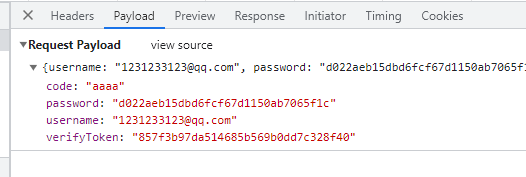

我们的密码被加密了

其他的code就是我输入的验证码

还有一个verifyToken这个加密参数，不知道哪里来的

### verifyToken

搜一下 这个

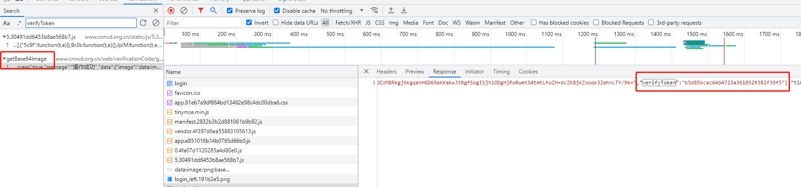

有两个关于这个参数的，

第一个是js里面，第二个是响应里面的，这个因该不同的图片的token不一样

作为验证码标识。

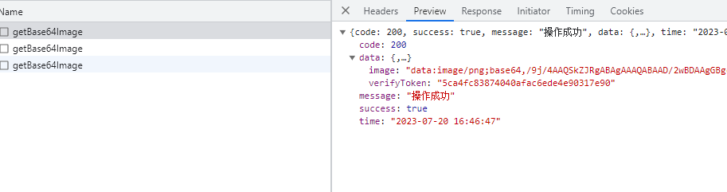

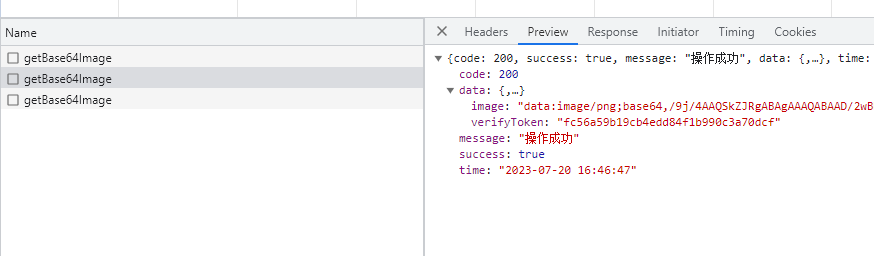

验证一下确实如此。

我们模拟一下请求图片看一下会不会返回。

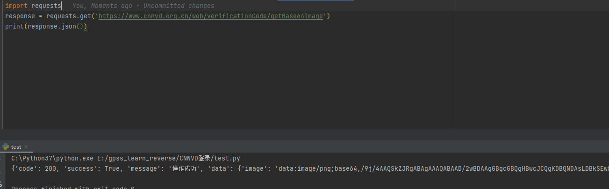

简简单单试了一下，不需要header和cookie

下面看password

### password

这里找password 采用的方法是 看堆栈，

submitform 提交表单，评经验点进去，

也可以选择下xhr断点，或者搜索跟栈，因为搜索关于password的会有很多，当然只要能找到加密位置就可以。

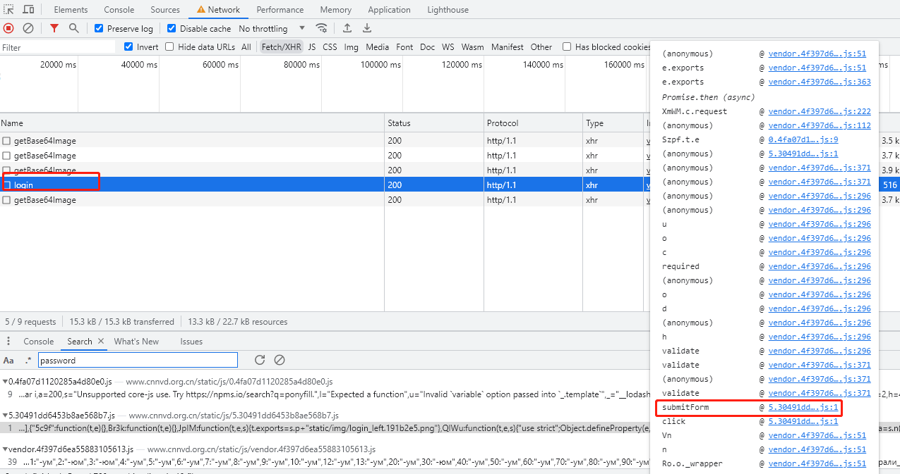

点进去，发现大差不差，直接断点安排

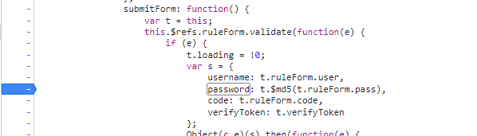

对内容进行分析，md5加密，

用123456测了一下没有进行魔改，md5还是很好实现的，python就有现成的库

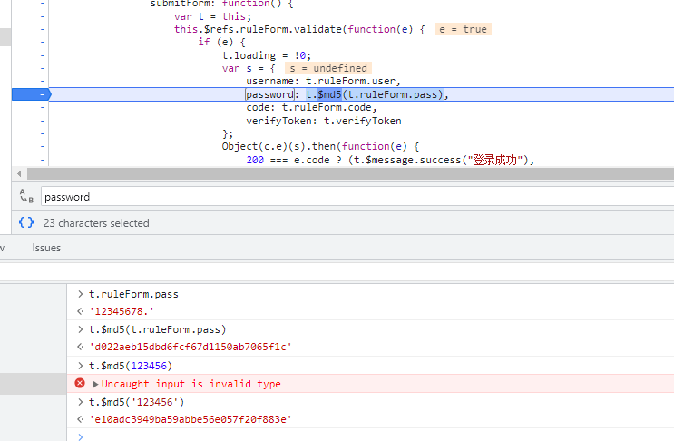

### 验证码识别

现在参数我们都有了，要识别验证码了。

这里选择的ddddocr 一个非常nice的识别库

~~~python
import ddddocr
ocr = ddddocr.DdddOcr()
with open('1.png', 'rb') as f:
    img_bytes = f.read()
res = ocr.classification(img_bytes)
print(res)
~~~

我们将整个流程穿起来，

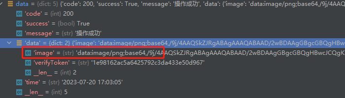

在这个获取图片的接口中 图片格式是base64的

可以通过这个方法进行获取

~~~python
import base64
import re

def analysis_base64(src):
    result = re.search("data:image/(?P<ext>.*?);base64,(?P<data>.*)", src, re.DOTALL)
    if result:
        ext = result.groupdict().get("ext")
        data = result.groupdict().get("data")
    else:
        raise Exception("Do not parse!")
    img = base64.urlsafe_b64decode(data)
    return img

~~~

将图片保存至本地，然后用ddddocr进行识别

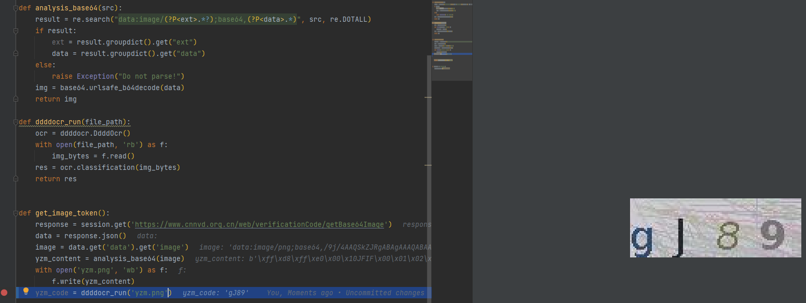

可以看到我debugger和图片是一样的，如果不一样可以多试几次（准确率较低的情况，可以选择第三方打码平台，超级🦅类似的，也可以选择自己做深度学习进行训练模型）

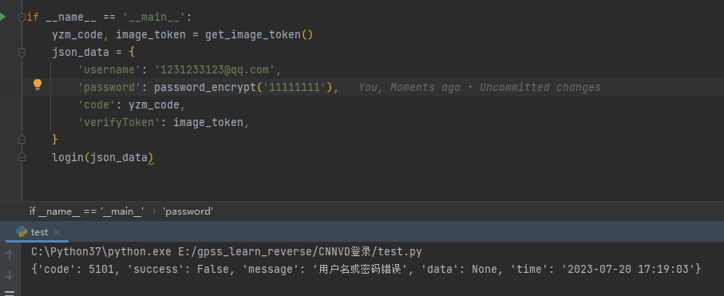

接口没问题，试一下正确的用户加密码

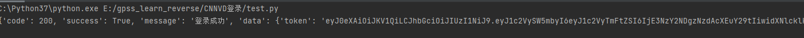

登录成功

## 总结

cnnvd的密码加密只有一个md5，

比较简单，不用设计js逆向

注意验证码接口和登录接口的流程就好

通过 verifyToken 进行验证码验证， **在登录这种连续性比较强的地方必须要用session**