# Cnvd国家信息漏洞平台

## 注意

<u>免责声明： 此文档，以及脚本，仅用来对技术的学习与探讨，如有冒犯，请联系作者电话，微信13933566015进行删除</u>

cnvd使用的产品是加速乐，通过cookie就可以看出来，经过测试 __jsl_clearance_s 才是需要搞的

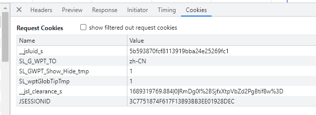

## 分析流程

通过fiddle抓包可以看出，大概流程分为三部里面前两次 521 最后一次200出结果了

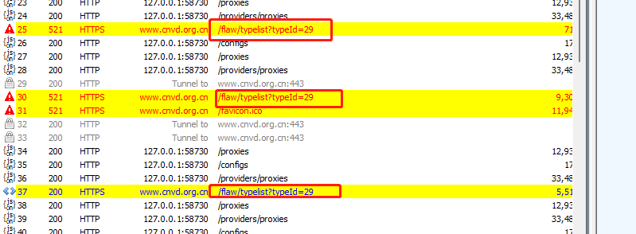

### 第一次请求

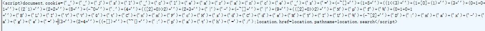

第一个请求的响应是一段 JS代码 生成 cookie ，可以通过模拟请求，将第一次cookie记录下来。

先复制到浏览器执行下来看看，

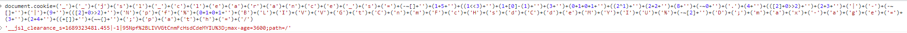

__jsl_clearance_s=1689323481.455|-1|95Npf%2BLIVVGtCnmFcHsdCdeMYIU%3D;

### 第二次请求

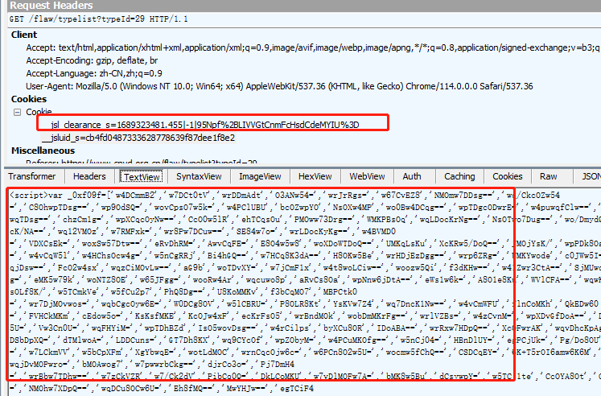

这里的cookie用到了第一次请求出来的结果，并又生成了一段JS文本，将这段JS先保存到本地，进行观察，此代码是一段OB混淆的代码。

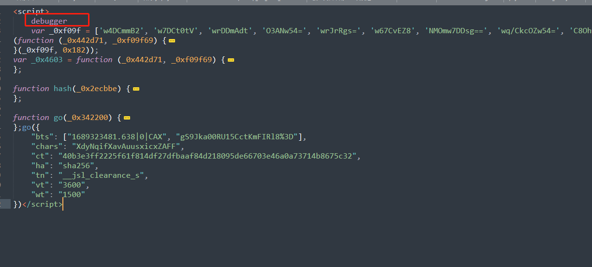

能看出来是执行了go的方法，我们将此文件替换到浏览器，进行debugger，清除浏览器站点cookie，

然后刷新页面让页面debugger住，

然后进行hook cookie

~~~js
(function () {
  'use strict';
  var cookieTemp = '';
  Object.defineProperty(document, 'cookie', {
    set: function (val) {
      if (val.indexOf('__jsl_clearance_s') != -1) {
        debugger;
      }
      console.log('Hook捕获到cookie设置->', val);
      cookieTemp = val;
      return val;
    },
    get: function () {
      return cookieTemp;
    },
  });
})();
~~~

输入hook代码之后，放断点，使hook生效，

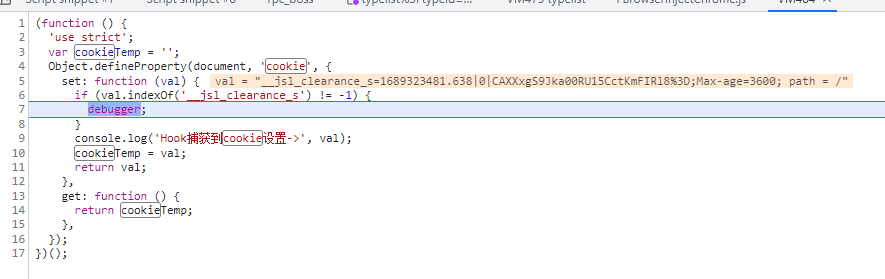

之后可以进行跟栈，找到set cookie的地方

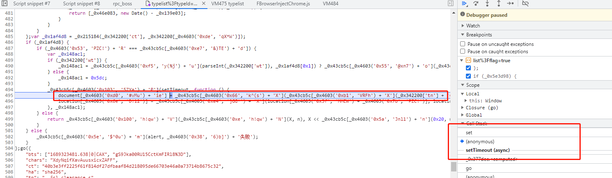

之后可以对此代码，进行拆解分析。

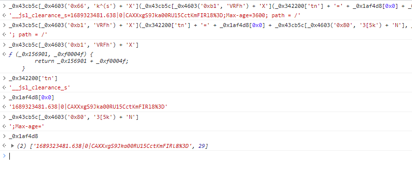

拆解完，可看到此处是我们要找的cookie值，在回到代码中查看出处，进行搜索 _0x1af4d8

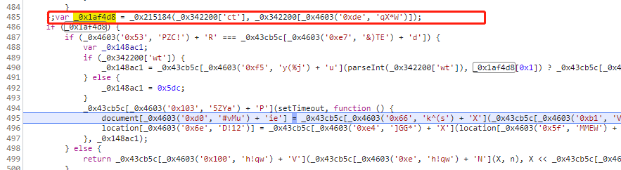

最近的就在上面，在此处下断。

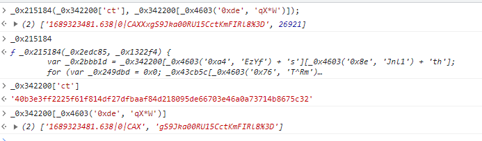

这里可以看到 _0x215184是一个函数，他有两个参数，这两个参数都来源于_0x342200

而这个0x342200，则是此段代码go函数中的入参

只要把这段代码跑起来就可以实现了，可以只扣出0x215184函数，我选择全粘下来，因为本来代码函数也就不多，用node独立实现一下。

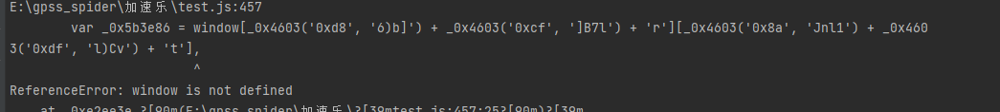

直接运行 缺少 window对象，进行环境补充 window = {}写到代码最上方，再次执行

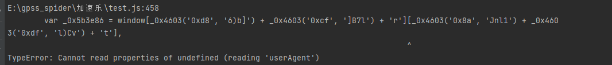

缺少 userAgent，debugger到此处查看原因

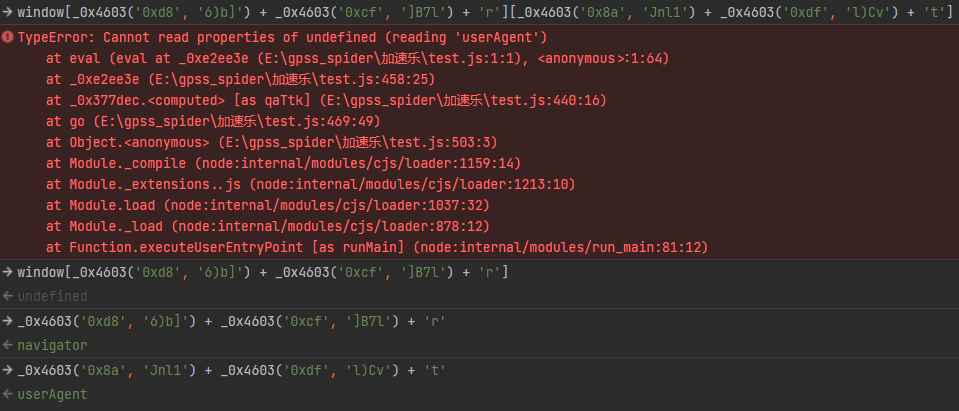

此处可以看出我们补充的window对象缺少 navigator 和 userAgent，这里再补一下 UA随便给的。

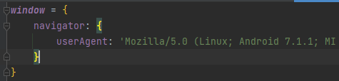

补完之后继续执行，缺少document 还是一样补，

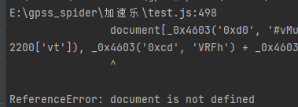

 补完之后继续执行，

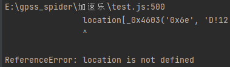

继续补.....................

补完之后location之后执行就不报错了。

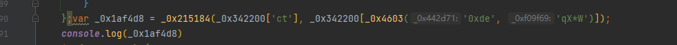

在此处打印一下。

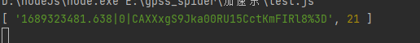

成功拿到结果，经验证这个可以用，通过python request，模拟这个流程即可。

### 第三次请求

将请求二中cookie拿到，可以直接用，接下来就是用python实现这个流程。

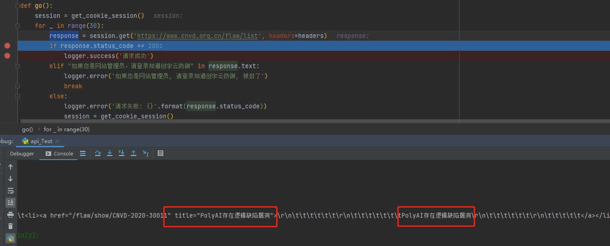

此处可以顺利拿到结果，证明整个流程已经通了。

## 总结： 

cnvd此网站，正常用户都需要如果点快了，会对其进行限流以及封ip行为，不要对网站进行攻击以及高并发爬取。