# IBOX数藏

> 网站地址： aHR0cHM6Ly93d3cuaWJveC5hcnQvemgtY24vbWFya2V0Lw==  
>
> https://github.com/Guapisansan/gpss_learn_reverse 代码在这里，会持续更新逆向案例

**免责声明： 此文档，以及脚本，仅用来对技术的学习与探讨，如有冒犯，请联系作者电话，微信13933566015进行删除**

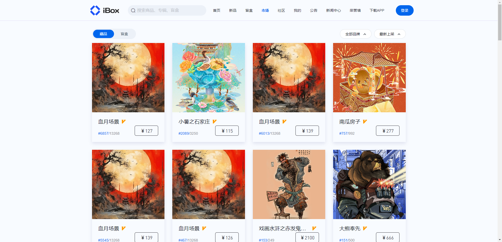

获取一个ibox的市场 列表

## 逆向分析

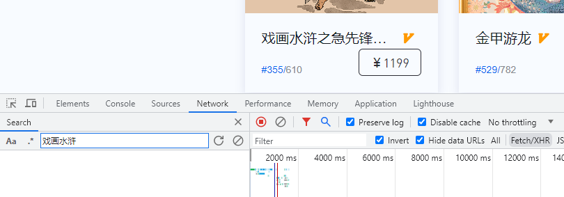

先尝试搜索请求，发现并没有。

看一下XHR里面的

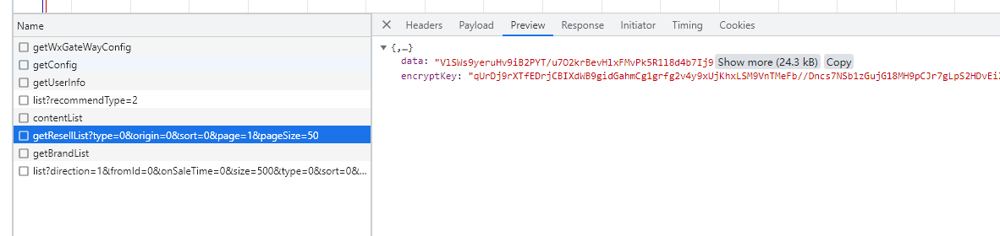

这块发现响应里的数据都是密文，

目前也不知道是哪个接口，

只能先把data和 encrypykey解出来，

全局搜索一下 encryptKey

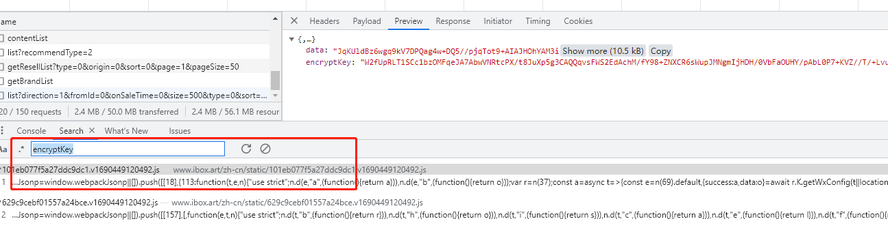

跟进去看看

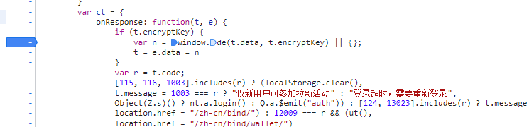

这里看着还是很像的，下一个断点刷新页面看看

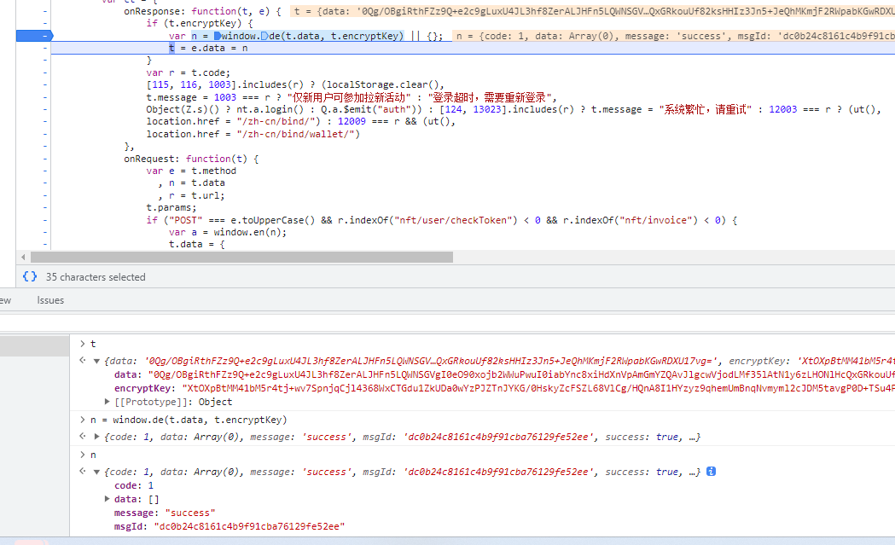

这里发现t 里有data和encryptkey 经过 window.de 生成n

n里面有data，但是里面是空。

这里打算在采用日志断点，看一下这个地方会不会出现我们想要的数据

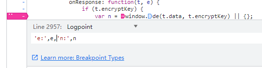

加一个日志断点，在重新刷新页面吧

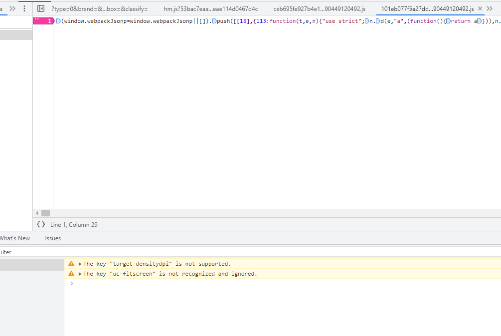

刷新完发现并没有生效，怀疑console.log被hook了

这里测试一下

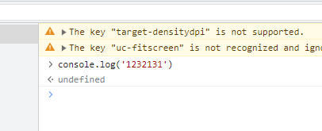

发现console.log打印不出来，那大概率就是被hook了

我们在 下一个脚本第一行执行的事件断点

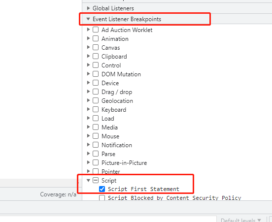

刷新页面

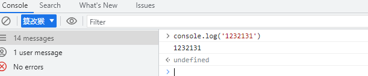

在这里console.log是可以使用的

这里我是用 Object.assign 来进行 copy 原因是 跟稳妥，如果 直接使用 = 这种赋值操作，更改了原型链还是不行的，所以使用深copy。

这里将日志断点更改一下

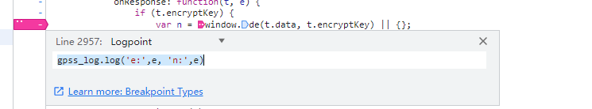

刷新看一下是否生效，

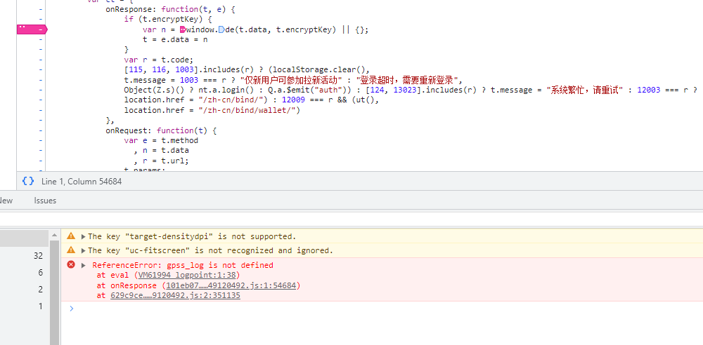

这里报的是gpss_log找不到 说明我们导出的没有生效，

这是为什么呢

再回到 事件断点位置吧，

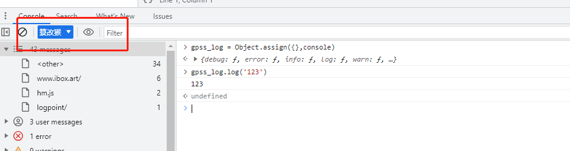

这里值得注意的是这个地方

我们在这个页面导出了，并没有到top页面导出

放一下断点吧，

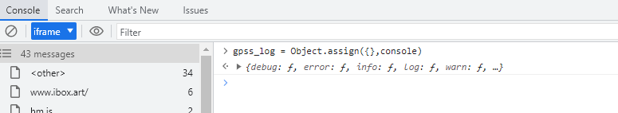

这个地方也来一次

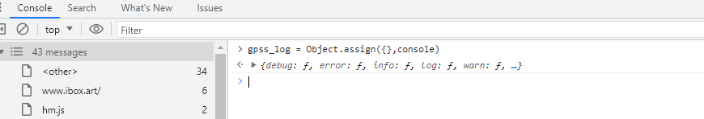

top层级也来一次

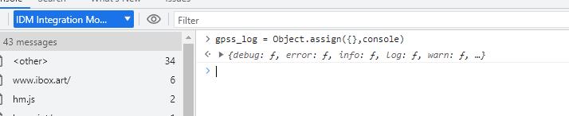

将 事件断点取消，放过

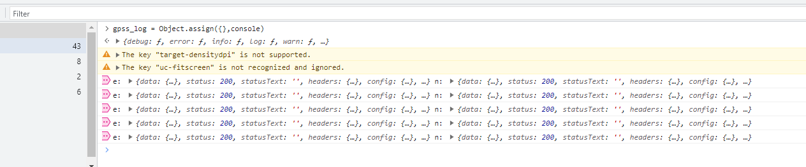

这里终于出现了我打的日志断点！！！！！

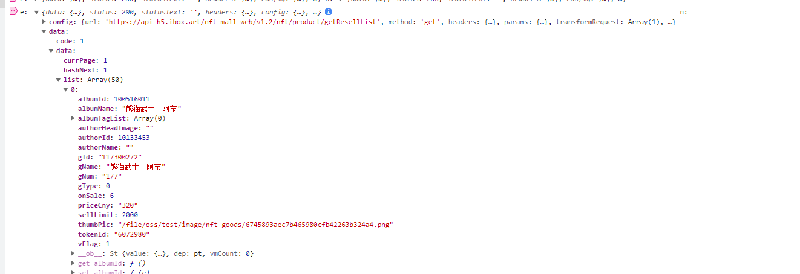

在这里翻到了我们要的数据

还看到了请求的地址

这样可以判断

product/getResellList 接口是我们要找的

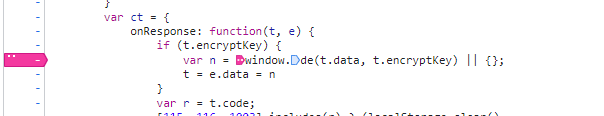

这里的window.de就是解密函数。

## window.de

将日志断点，换成普通断点

刷新页面

将window.de搞定就可以了

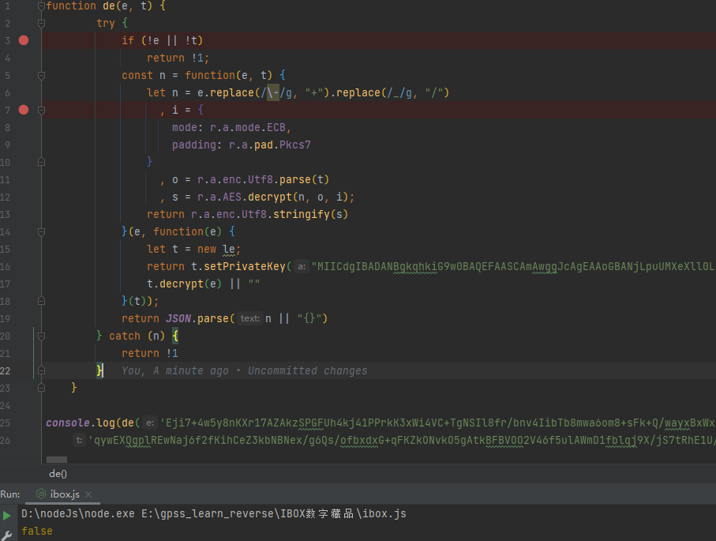

 

可以很明显看出来这个de 是一个 aes的加密，

传进去的data 和 encryptKey

而encryptKey通过 setPrivateKey可以判断出是rsa

rsa进行解密 当作aes的key

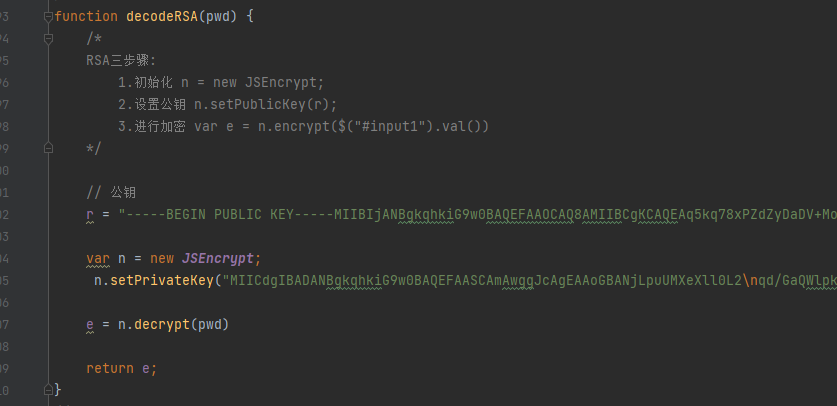

将私钥复制下来，获取key

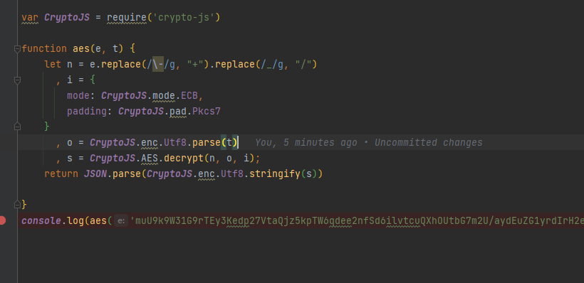

在实现一下aes。

# 总结

通过rsa解密获取key，作为aes的key

没有混淆还是很好解决的

开始没认出是rsa 很蠢，扣了半天代码

还是经验太少了，做rsa加密比较多，换个解密就没想到真是sb

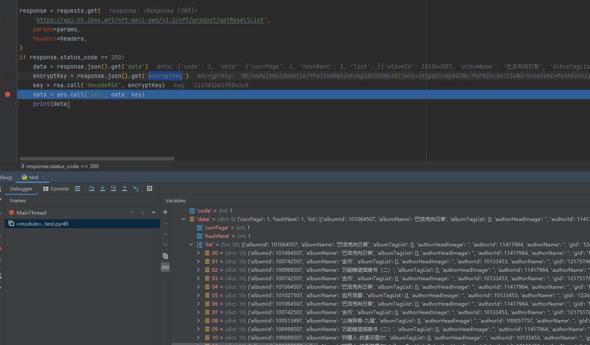

这里打一下请求试一试就成了

