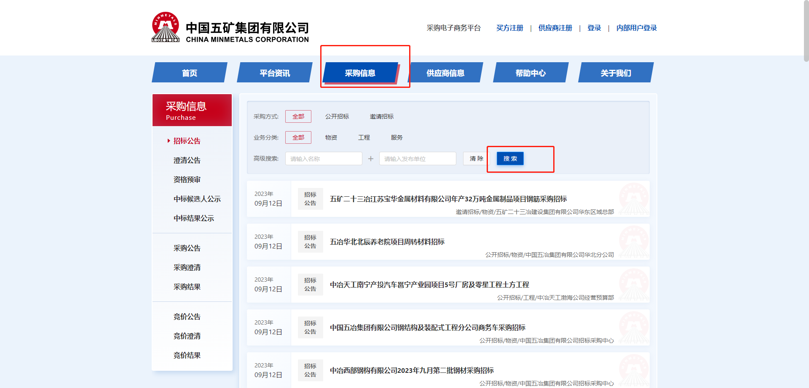
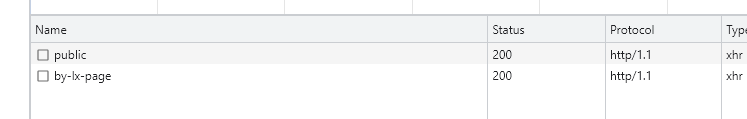
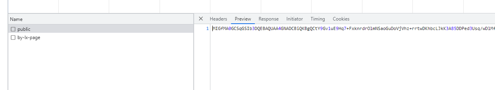
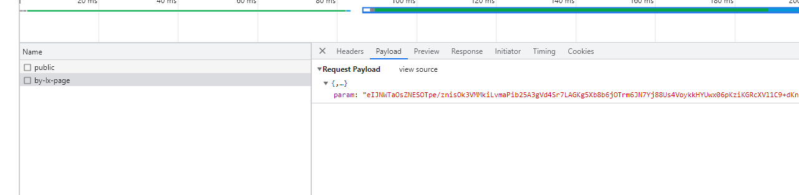
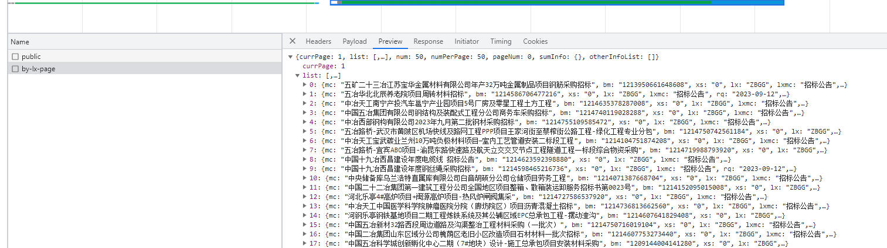
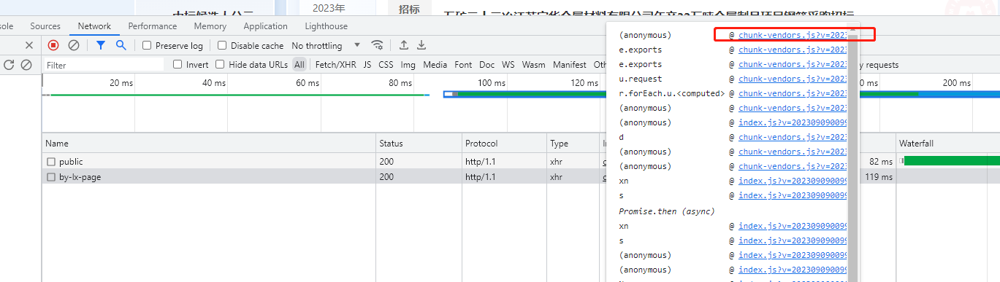
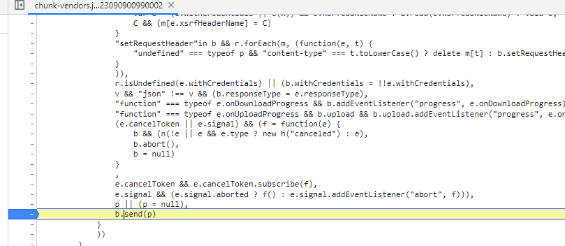
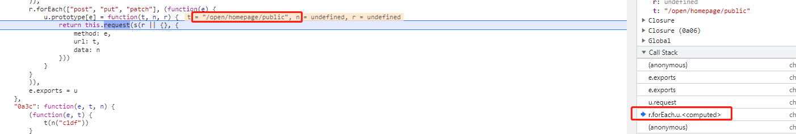
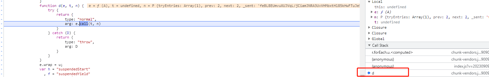

# 五矿集团

> 网站地址： aHR0cHM6Ly9lYy5taW5tZXRhbHMuY29tLmNuL2xvZ29uQWN0aW9uLmRv
>
> https://github.com/Guapisansan/gpss_learn_reverse 代码在这里，会持续更新逆向案例

**免责声明： 此文档，以及脚本，仅用来对技术的学习与探讨，如有冒犯，请联系作者电话，微信13933566015进行删除**

这里点击采购信息，来看一下这个搜索接口吧

## 分析流程

点击搜索弹出俩了两个接口

第一个像一个rsa公钥，public接口名称也像是公钥

第二个接口是一个param参数加密的

响应没有密文，还是比较友好。

先重放一下看看去除一些不必要参数。

经过测试这里有 ua检测

所以ua要加上，其他的可以去掉。

所以我们只要把param参数拿到就ok了

## 逆向分析

### param

跟一下这个加密吧

在这地方下个断点，点击搜索按钮

向前跟栈

这里可以看到请求的位置，但是这个地方是 public接口，不是我们要找的

可以先下一个断点吧

点击下一步，直接来到我们想要的，可是param已经生成了，继续往前跟栈。

来到这个d的地方重新来一次

这个地方出现了