# 中远海运

> 网站地址： aHR0cHM6Ly9zeW5jb25odWIuY29zY29zaGlwcGluZy5jb20vYmlkLz9sYW5ndWFnZT16aA==  
>
> https://github.com/Guapisansan/gpss_learn_reverse 代码在这里，会持续更新逆向案例

**免责声明： 此文档，以及脚本，仅用来对技术的学习与探讨，如有冒犯，请联系作者电话，微信13933566015进行删除**

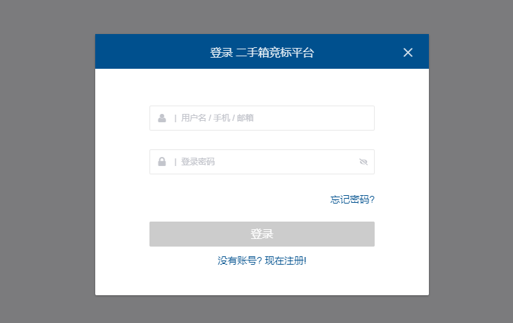

来搞一下这个登录接口，

## 分析流程

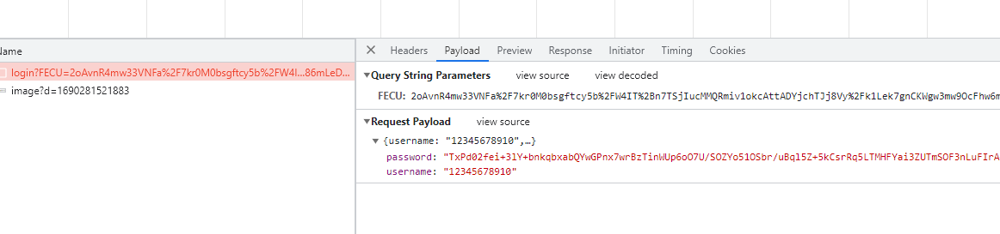

发现有param和 payload两个参数

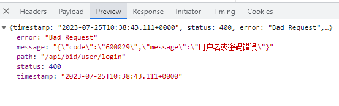

响应可以看到是，明文，不用管了，

模拟一下请求，看一下cookie和headers

有没有加密参数。

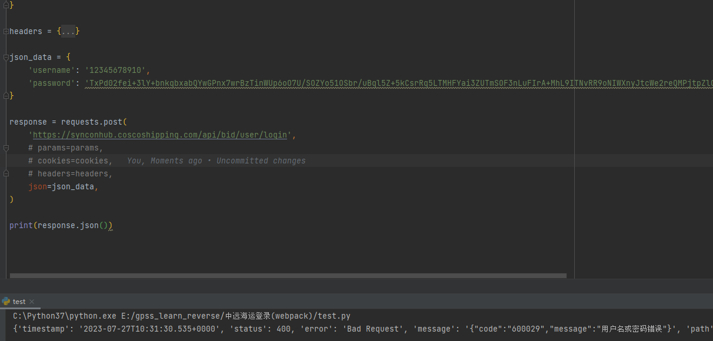

经过测试不需要cookie和headers，param

所以只看 payload

## 逆向分析

### payload

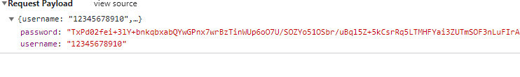

先搞一下密码吧

用户名是明文不用动

全局搜索password看一下有没有收获

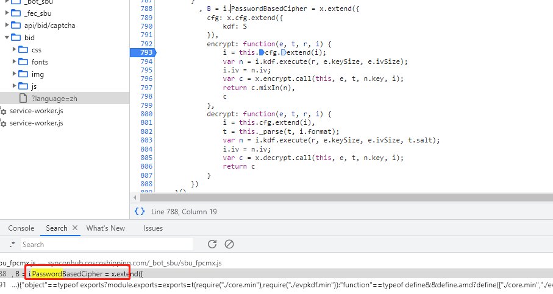

这个地方看起来像，下一个断点试一试呢。

断不住，，，

通过搜索感觉找不到，换一种方式，

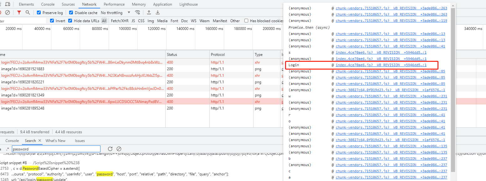

看堆栈

这里login很明显，点进去下断点

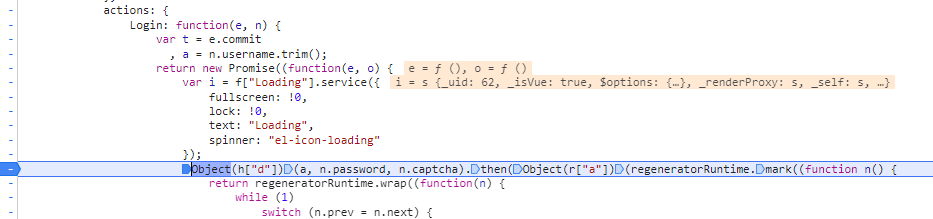

这里发现了

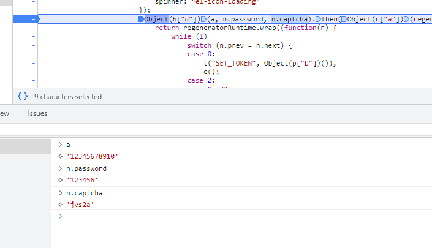

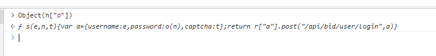

这个

Object(h["d"]) 接受了 三个参数。跟进去

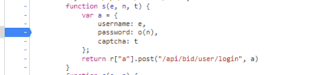

下断点重新请求吧

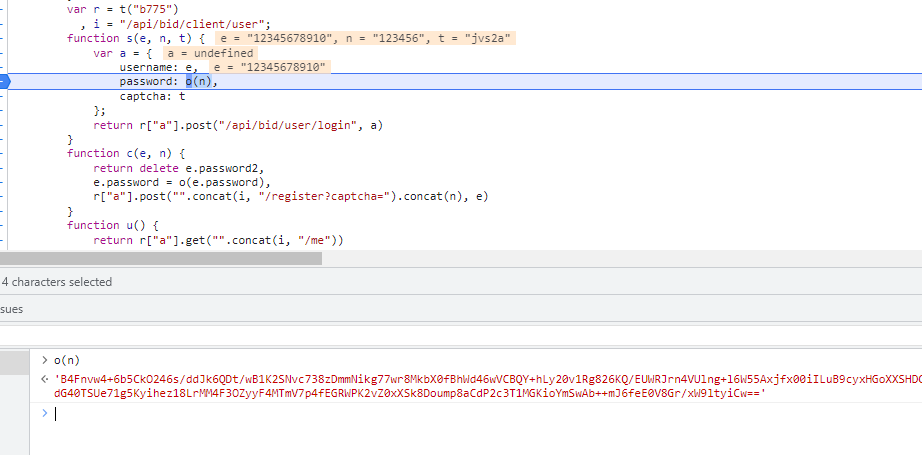

发现 o就是加密函数，跟进去下断点

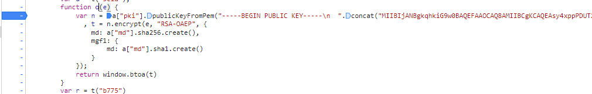

发现是一个RSA加密，

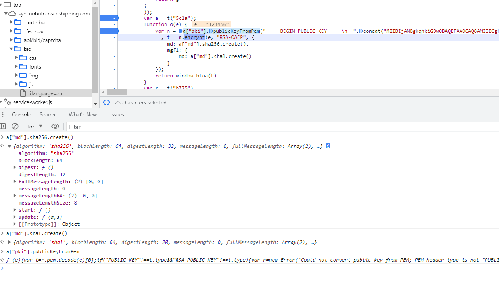

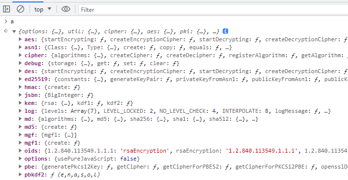

所有加密都来自于a对象，靠扣代码不太现实，因该找到a导出，这里

可以看出来

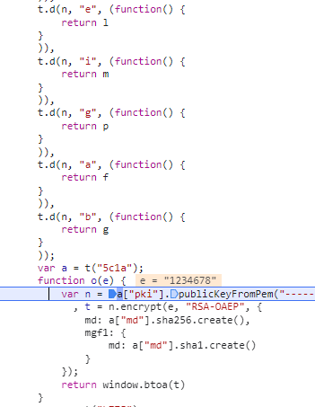

a由于 t生成， **这种情况属于webpack打包特征，同一个方法传入不同的参数，t("5c1a")**

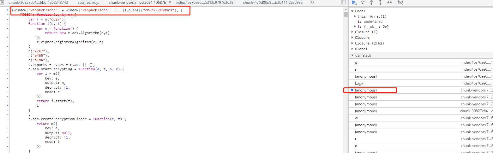

在这里也可以看的出来是webpack打包

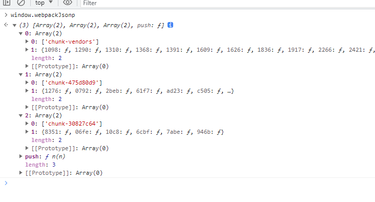

webpack打出来子文件

这里的t类似于加载器，

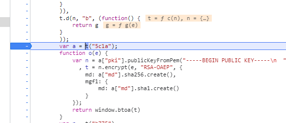

断点打到t 加载的地方

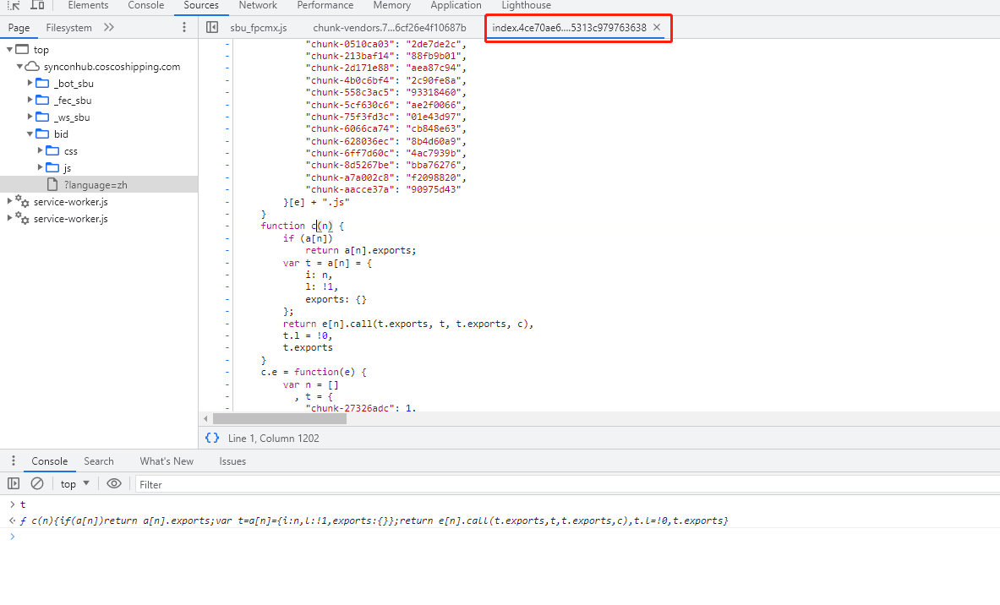

t函数来自index巴拉巴拉文件，没有在子文件里面，说明index 是主文件

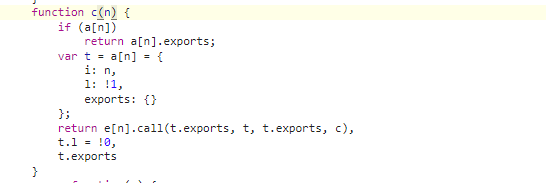

主文件的这个函数 加载器函数，这样基本就是webpack

### webpack扣代码

先把主文件和子文件都扣下来

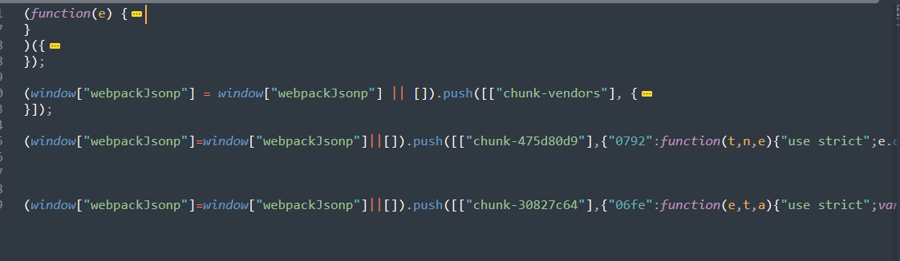

行数很多这个里面有9w多行不过没有关系

注意一定要将，webpack初始化注释掉，不然会有影响的

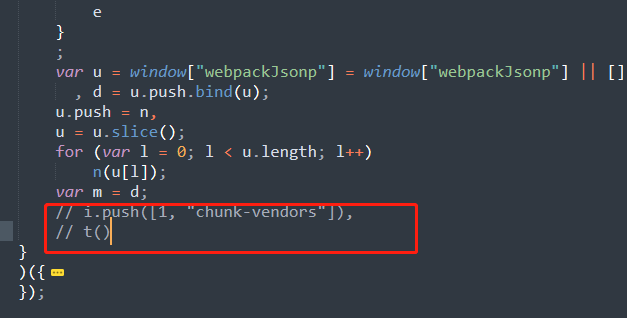

在主函数的最后两行，

将处理好的代码放到，浏览器上跑一遍，

不报错就说明可以

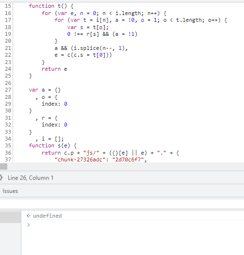

再将，加载器的导出一下。

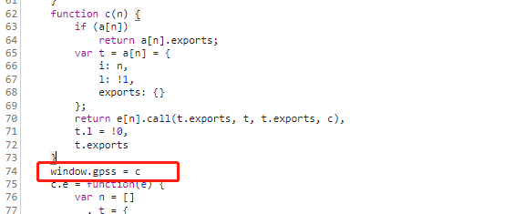

来到加载器这里

window.gpss = c

c函数就是我们的加载器

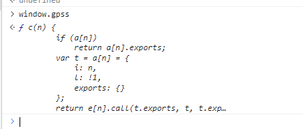

已经导出来，测试一下

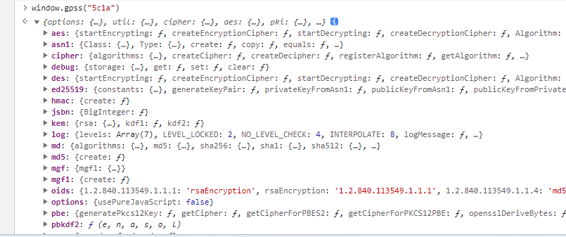

将所有方法都导出来了，

来测试一下吧

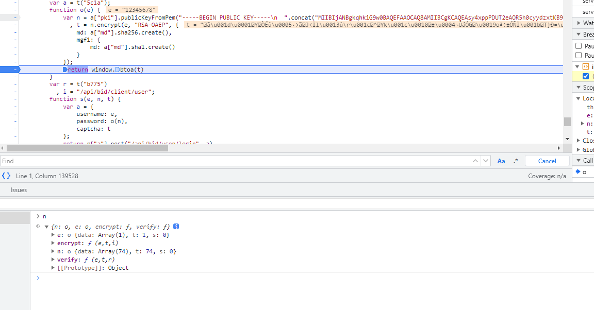

这是网站生成的n

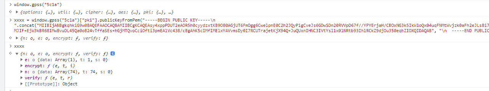

导出的和他网站的生成值一样

说明没问题了。

## 总结

主要是分析这个密码的加密流程，不需要进行扣代码，也没办法一层一层去扣，知道是webpack了将整体都搞下来更省时间更快速，

将加载器导出，所有函数都可以得到。

关于webpack：

1. 找到加载器位置，确认主文件
2. 通过window.webpackJsonp,确认子文件
3. 将子文件和主文件粘贴下来
4. 注释掉主文件中的初始化内容
5. 将加载器导出至全局，运行测试结果

**扣webpack是重点，登录不是重点**