# 今日头条

> 网站地址： aHR0cHM6Ly93d3cudG91dGlhby5jb20v  
>
> https://github.com/Guapisansan/gpss_learn_reverse 代码在这里，会持续更新逆向案例

**免责声明： 此文档，以及脚本，仅用来对技术的学习与探讨，如有冒犯，请联系作者电话，微信13933566015进行删除**

来抓一下，信息

## 流程分析

先抓包刷新页面看一下接口吧

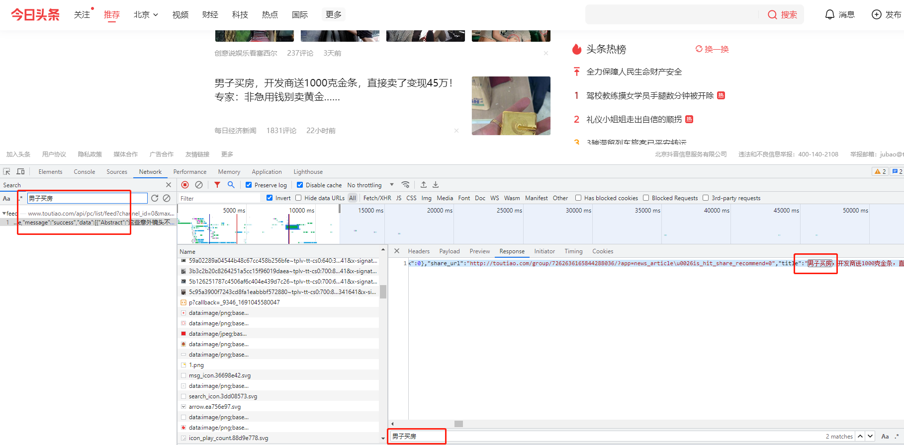

直接开搜索快速定位接口

找到接口后，使用fiddle做重放攻击，看一下相同参数能不能请求成功

https://www.toutiao.com/api/pc/list/feed

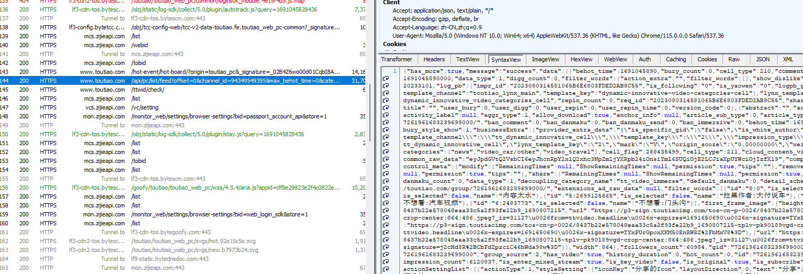

这么看是有数据的

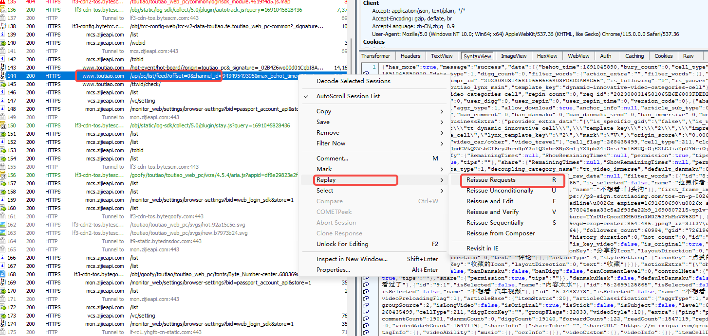

经过3次重放

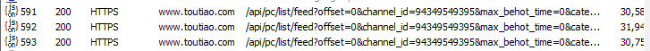

都是有效果的说明参数短时间没有实时变动。

这样就可以分析去除参数了

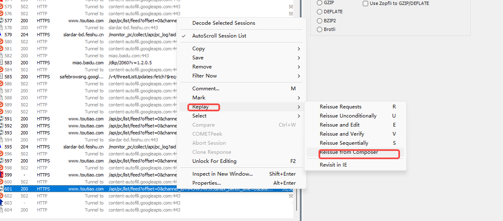

这次来重放编辑参数

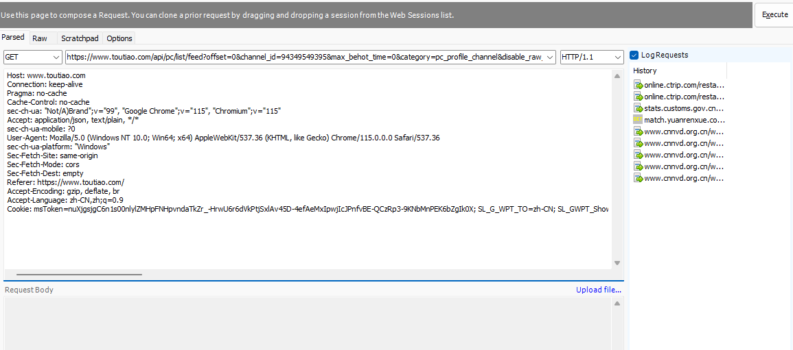

这里验证了

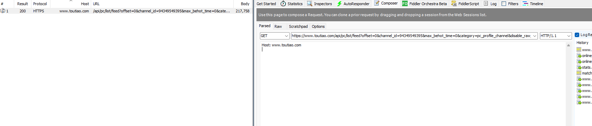

header里面大部分都删除还是可以的cookie也可以不用加

再看get的参数

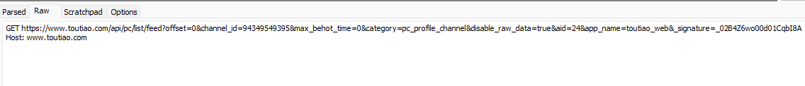

测试了一个参数不能少，他娘的

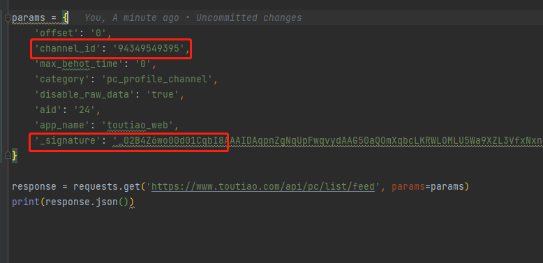

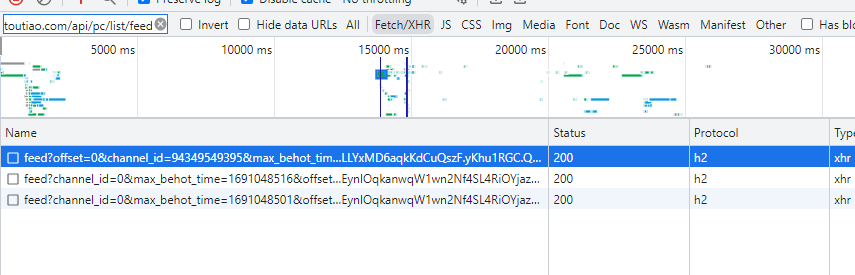

经过测试发现如果是刷新页面 channel_id为 94349549395  max_behot_time 是0

这里搜一下

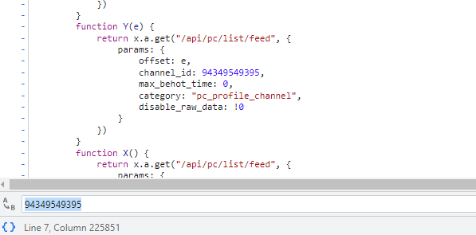

是一个定值，

如果滑动鼠标滚轮，向下滑动，触发feed接口

channel_id 是 0

max_behot_time 则是时间戳

所以要逆向的也就是 **_signature**

## 逆向流程

### **_signature**

直接全局搜

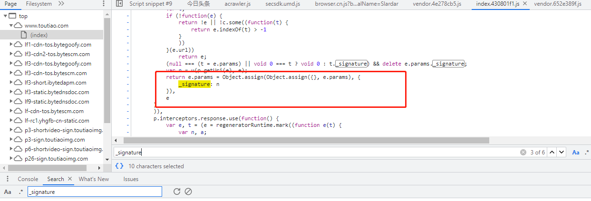

这里两处对 _signature

都打上断点吧

往下滑触发断点

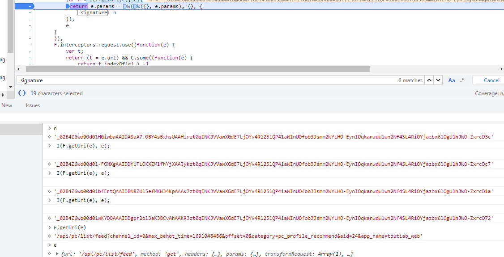

F.getUri(e) 是url参数，e是一个请求对象

I是加密方法

跟进去看看

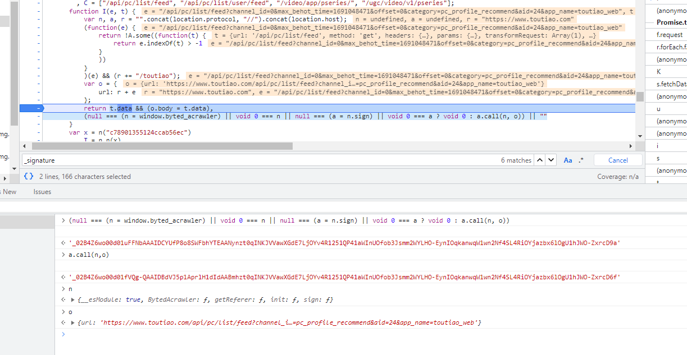

发现这个   加密是 这个a.call(n,o)

n 来自   window.byted_acrawler

a = n.sign

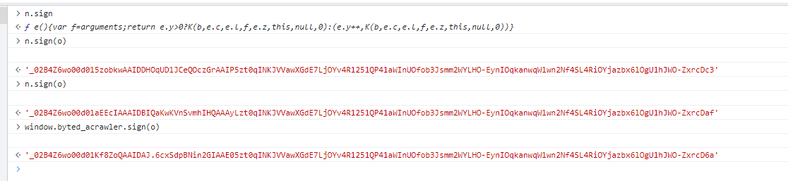

所以我们只要能得到window.byted_acrawler就可以了

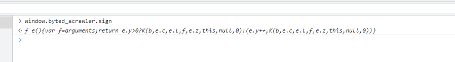

定位进去看看是个什么玩楞

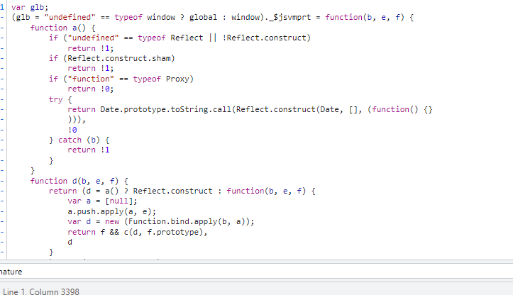

是个jsvmp，扣代码肯定是不可能了

全粘下来看看吧，这个window.byted_acrawler由这个生成的

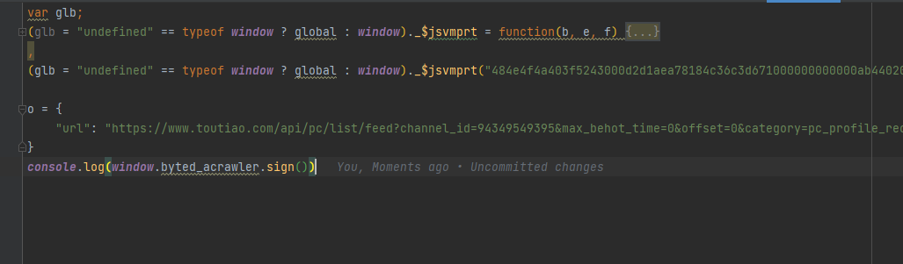

用node试一下能不能行

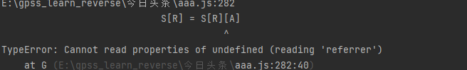

直接报错，

这个referrer是来自document

在页面上可以试试

我用jsdom补一下吧

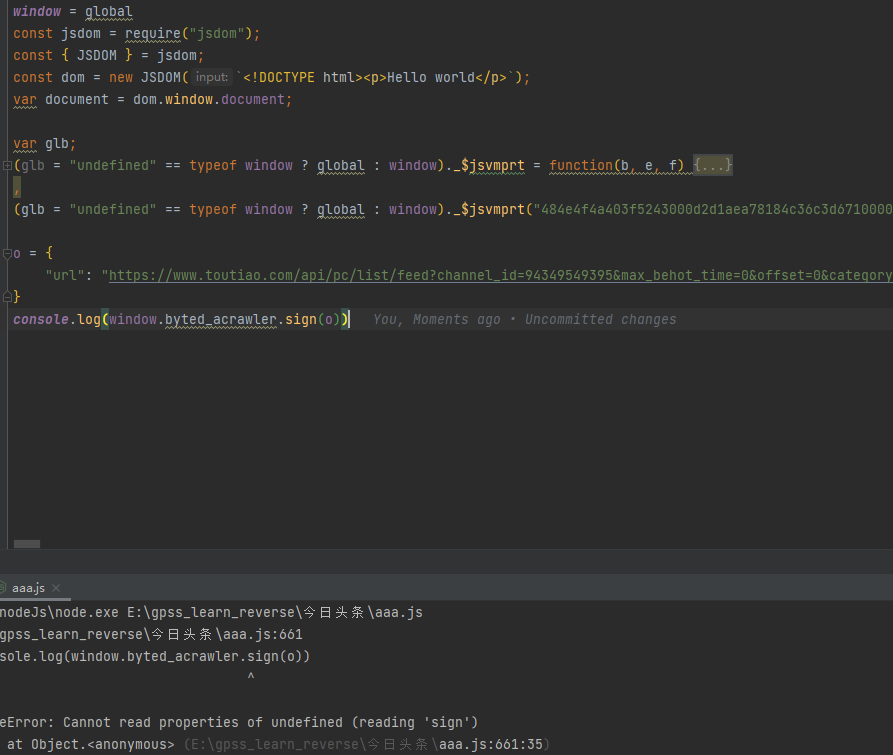

补了一下dom和window

报sign找不到

可以看出来

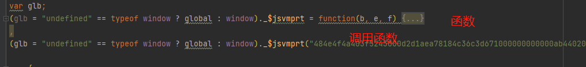

对比一下调用函数和 页面调用的有什么不同

这里的b和e就是传进来的参数

经过对比

第一个参数(长的字符串)没什么区别

看一下数组

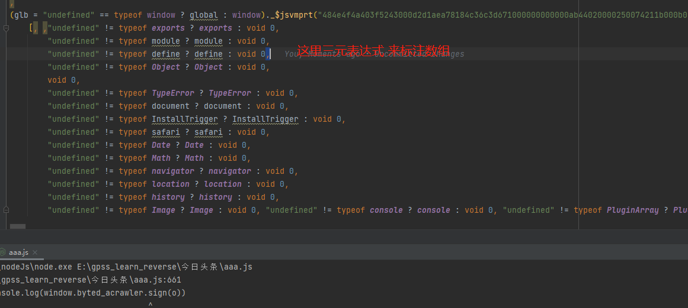

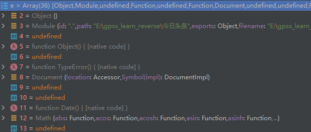

我执行的数组和他的不一样

页面上前三个都是undefined

我也将数组改为underfined

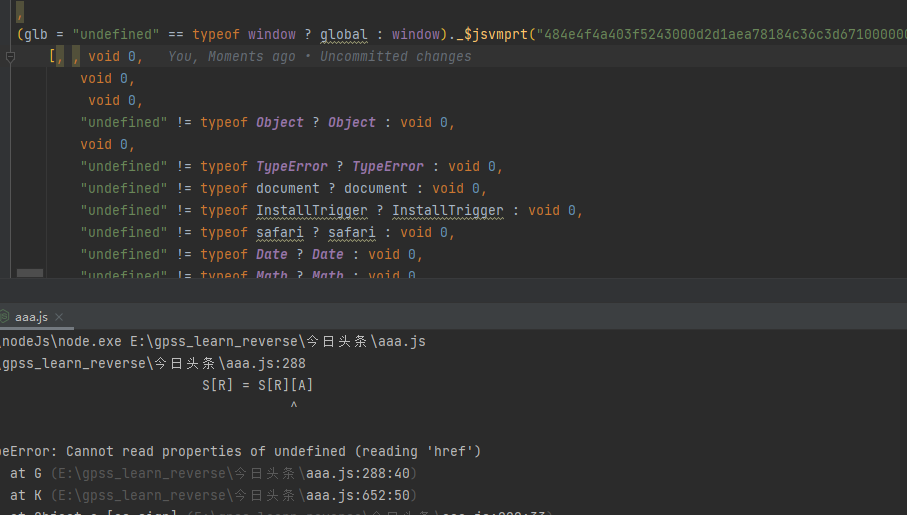

这里将前三个改为underfiend

报错变成了 href

找不到

这个href来自于document.location.href

看一下页面的

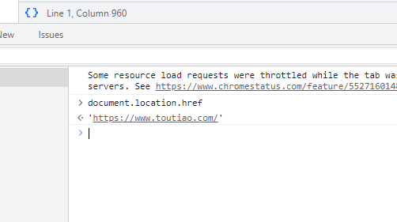

我们还是用jsdom补

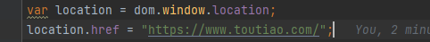

再次执行

缺少UA了

还是一样加上

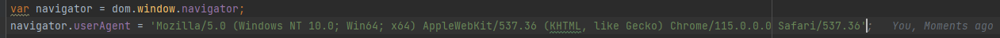

再次运行

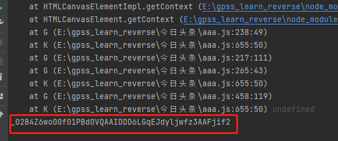

sign出来了，但好像短了一点，经过测试是可以用的

这样今日头条的流程就出来了

## 总结

今日头条用到了jsdom进行补环境

看一结果吧

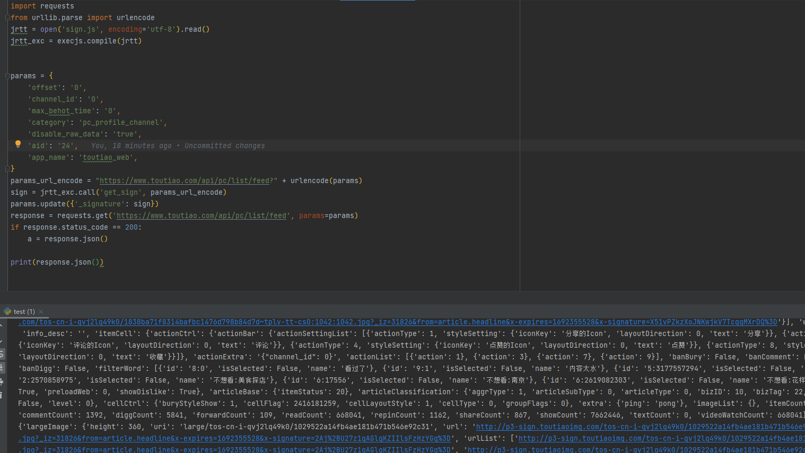