# 优师云登录

> 网站地址：aHR0cHM6Ly93d3cueW91c2hpeXVuLmNvbS5jbi9sb2dpbi9pbmRleA==
>
> https://github.com/Guapisansan/gpss_learn_reverse 代码在这里，会持续更新逆向案例

**免责声明： 此文档，以及脚本，仅用来对技术的学习与探讨，如有冒犯，请联系作者电话，微信13933566015进行删除**

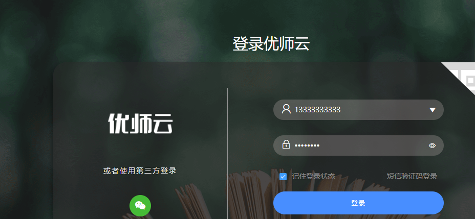

尝试通过接口登录这个页面

## 查看接口

​	随便输入一个用户名密码，

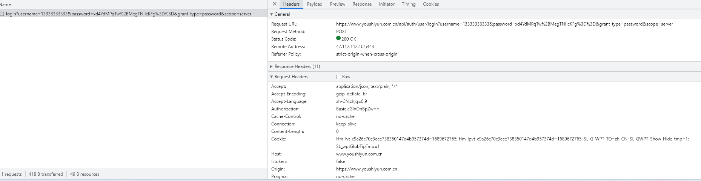

一个普普通通的post请求

headers里也没有可疑参数

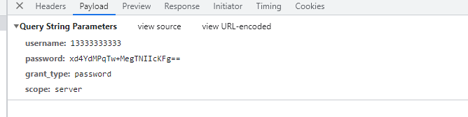

这里的password是密文，其他都是明文，

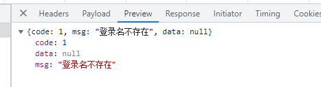

响应也是明文，也就是说找到密码加密的地方就ok了

## 寻找加密

这里采用了xhr断点的方式来寻找加密。

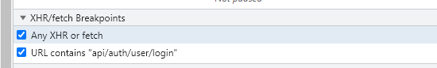

在这里把接口路由添加到这里。点击登录

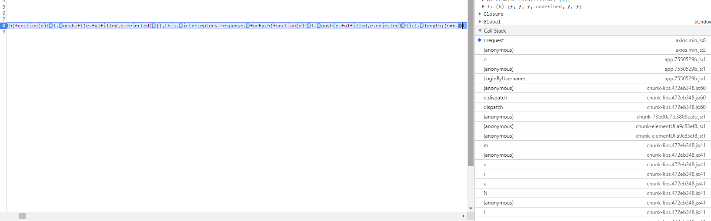

堆栈都在这里，开始寻找加密位置，

其实就是挨着点，点进去看那个地方像就仔细看看，

先看第一个t.request

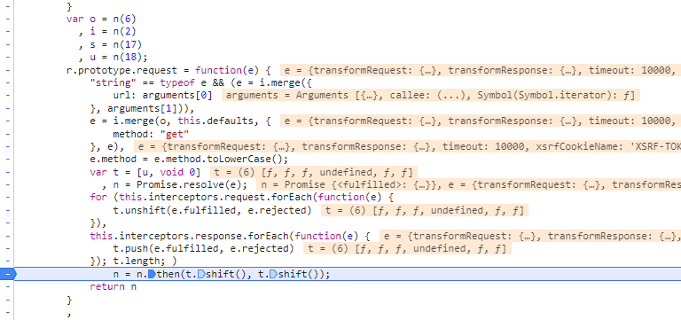

这里看着没有加密信息。

再看o

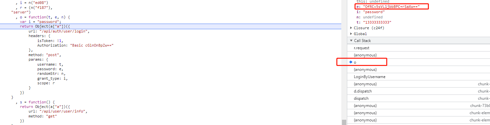

这里有关于password的信息，但是这个e已经是加密过的了，再往前翻，

来到   LoginByUsername 

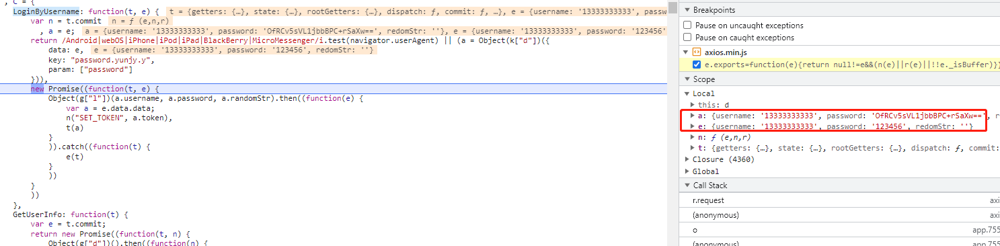

这里就相当明显了，**密文明文交界处**，将断点打到这里。

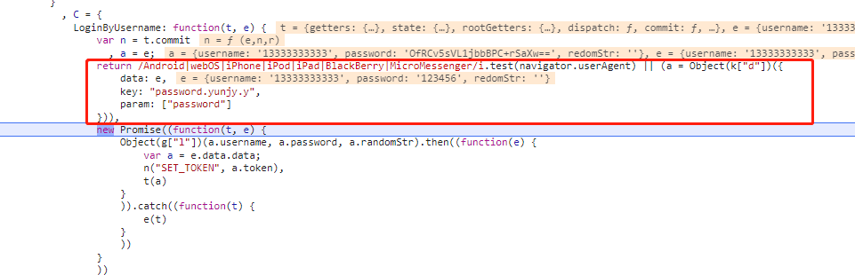

注意这里，将每一步拆分，可以看到 加密函数了。(a = Object(k["d"]))

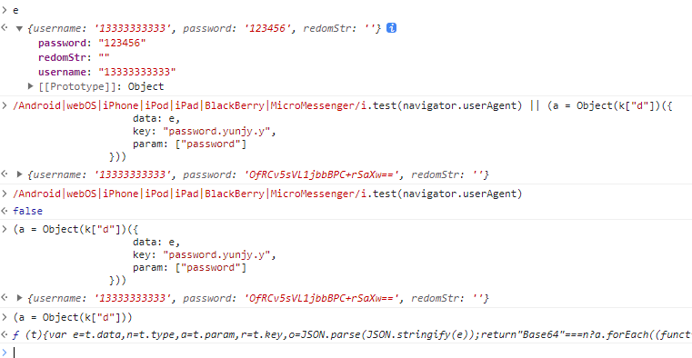

## 实现加密

找到了加密入口，跟进去

这里是一个AES加密，我们按照他的逻辑完全，用js实现一下就ok

~~~~javascript
var o = function(t) {
    var e = t.data
      , n = t.type
      , a = t.param
      , r = t.key
      , o = JSON.parse(JSON.stringify(e));
    return "Base64" === n ? a.forEach((function(t) {
        o[t] = btoa(o[t])
    }
    )) : a.forEach((function(t) {
        var e = o[t];
        r = CryptoJS.enc.Latin1.parse(r);
        var n = r
          , a = CryptoJS.AES.encrypt(e, r, {
            iv: n,
            mode: CryptoJS.mode.CBC,
            padding: CryptoJS.pad.ZeroPadding
        });
        o[t] = a.toString()
    }
    )),
    o
}
~~~~

然后将参数复制下来看一下呢，

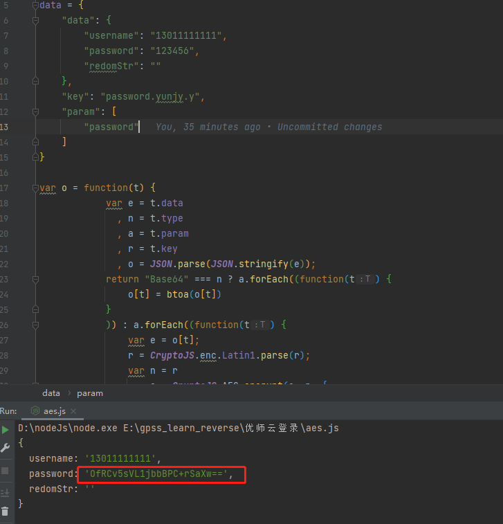

拿到了，去测试接口。

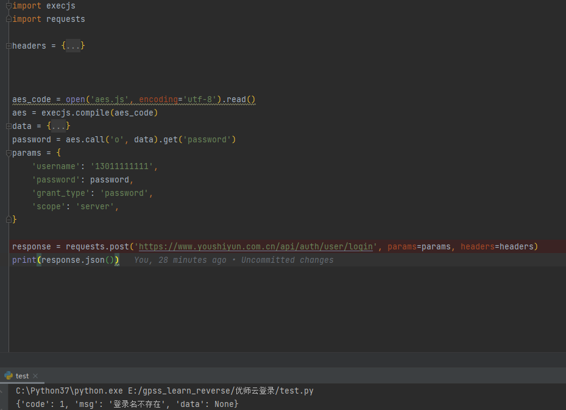

接口通了，

# 总结

这个逆向比较简单，只要找到加密入口就好，除了密码其他都是明文，响应也是明文，

headers里没有其他需要搞得参数。

用正确用户名密码验证一下吧。

.。。。。。。

我这里注册不了可能因为这个？？？

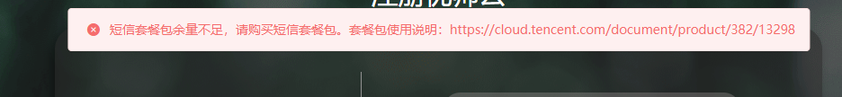

收不到验证码，哈哈哈哈哈哈哈哈哈哈哈哈，有账号的自己可以测一下，我觉得大差不差的

