# 唯品会WEB端	

来看看唯品会是怎么回事，

> 地址：aHR0cHM6Ly93d3cudmlwLmNvbS8=  

**免责声明： 此文档，以及脚本，仅用来对技术的学习与探讨，如有冒犯，请联系作者电话，微信13933566015进行删除**

## 目的

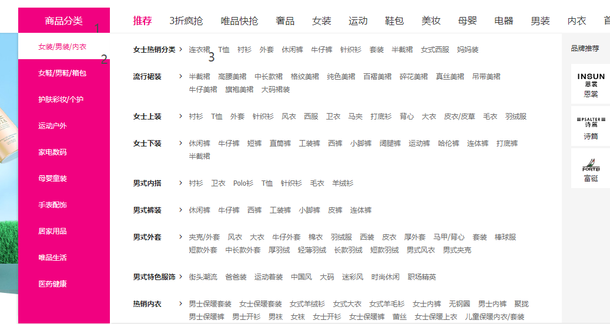

这里点击商品分类，点击女装，男装，内衣， 随便点一个连衣裙

弹出新网面，10000件商品 84页。

## 流程分析

刷新一下弹出的列表页。来搜索一下 “2023夏季新款法式优雅” 这个关键字

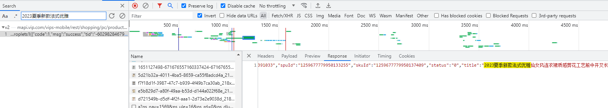

这里直接可以搜索到一个接口

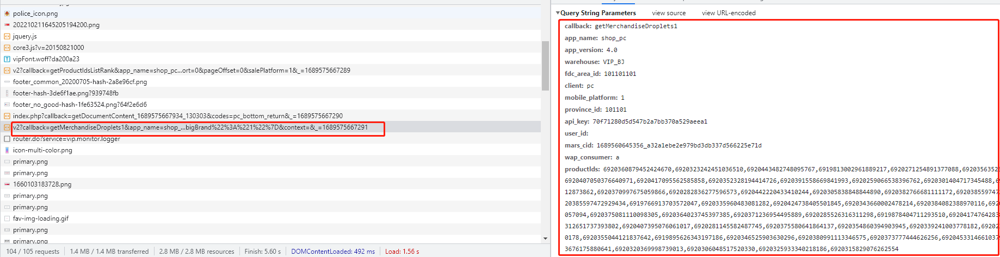

vips-mobile/rest/shopping/pc/product/module/list/v2 这个接口返回的信息，我们通过模拟查看参数，

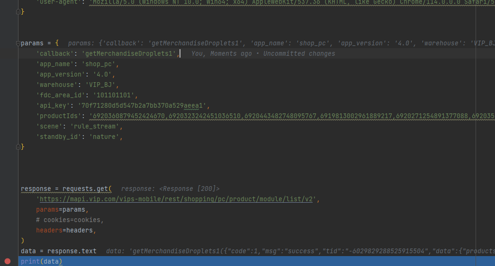

这里通过测试，删减参数的方式去除不必要参数，

callback： 貌似是回调函数，不同接口因该不一样 （可以不动）

app_name: 应用名称 （可以不动）

app_version: 应用版本 (可以不动)

warehouse: 仓库 （可以不动）

fdc_area_id: 区域ID (可以不动)

api_key: 密文，需要解决。

productIDS: 产品id 列表 需要解决。

scene: 规则模式 (可以不动)

standby_id: 看不懂，非加密字符，暂不解决

**所以经过分析，目前需要解决的只有api key 和 productid 列表**

#### getMerchandiseDroplets1：api_key

先全局搜索api_key, 看看效果

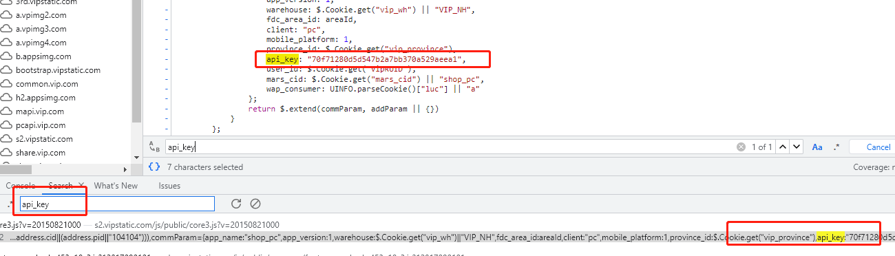

这里看似是写死的字符串，好几个JS文件都是 写死的api_key，有可能是定期更换，目前看来是固定的参数，所以就先不管了，需要定期观察。

#### getMerchandiseDroplets1：productids

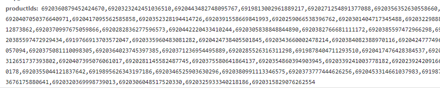

这些id猜测是对应不同的产品，

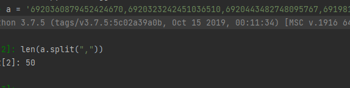

一共有50个产品

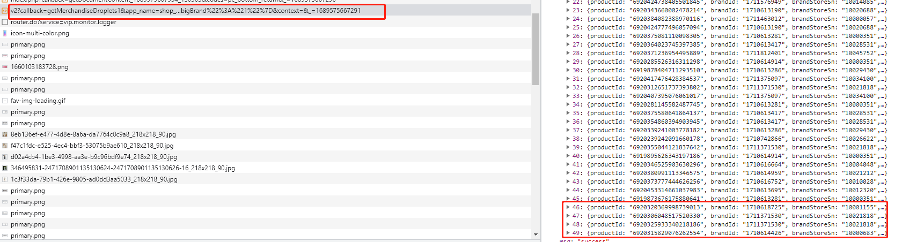

而在接口列表里也印证了这一点，所以找到哪里提供的这些产品id。随便搜索一个，6920371236954495889

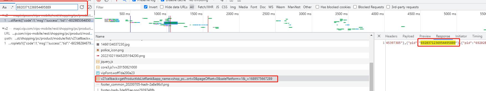

还是同样的vips-mobile/rest/shopping/pc/product/module/list/v2接口，需要注意的是这次call_back的参数变成了 getProductIdsListRank 。

看一下相应

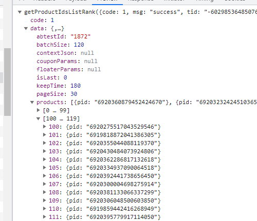

里面有120个pid 前五十个正好和上面的可以对应起来。

往下滑动页面看看，能不能触发后面的产品id。

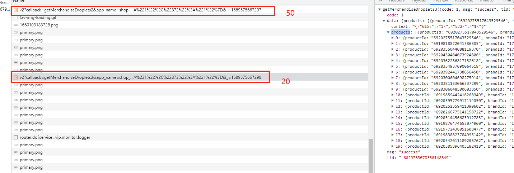

所以这个触发流程是， 浏览器刷新页面，先产生getProductIdsListRank 列表有120个产品id，触发第一个getMerchandiseDroplets1 取50个产品id，

再通过下滑页面触发后面的50个，20个。继续看getProductIdsListRank 接口的参数

#### getProductIdsListRank：接口分析

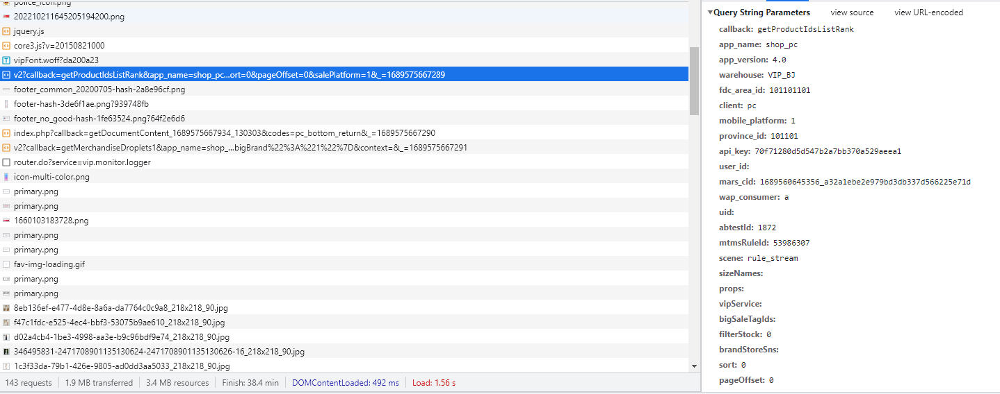

这里通过测试，删减参数的方式去除不必要参数，

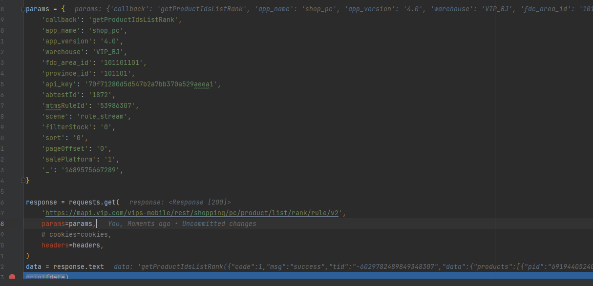

和上面相同的参数就不再介绍了，

abtestId：看不懂，暂时不动

mtmsRuleId：什么规则id，看不懂暂时不懂

filterStock： 筛选库存？？？因该用不到 

sort：排序用不到

pageOffset：分页

salePlatform：销售平台用不到

清空一下请求 在重新刷新：

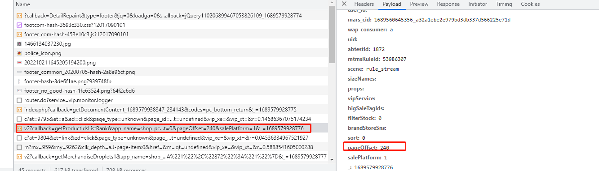

发现参数只有pageoffset变了，所以其他参数我们不动就可以了。一页120个产品正好对应起来了。

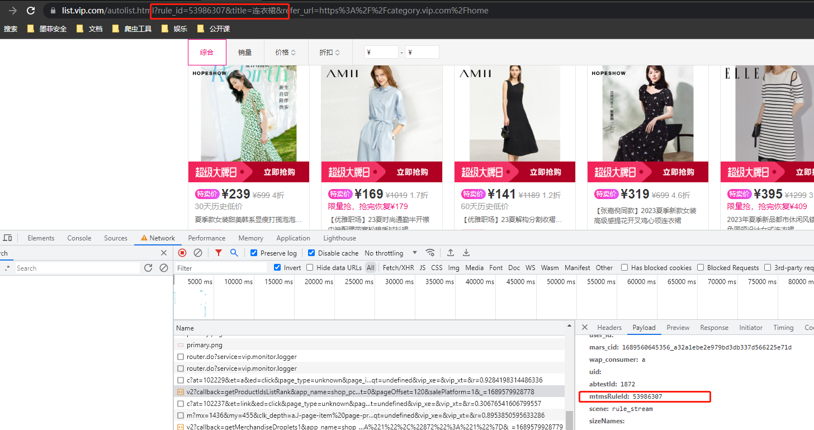

这里可以知道**mtmsRuleId**因该就是产品类型，产品类型的id，我们可以搜索一下看看能不能找到，在这个页面没有搜到，

猜测：在主页点进去的大概率在主页请求的，去主页再测试一下

把鼠标放在女装这里，

触发了接口，

可以看出来这个getSubCategory30074返回的都是这些类别

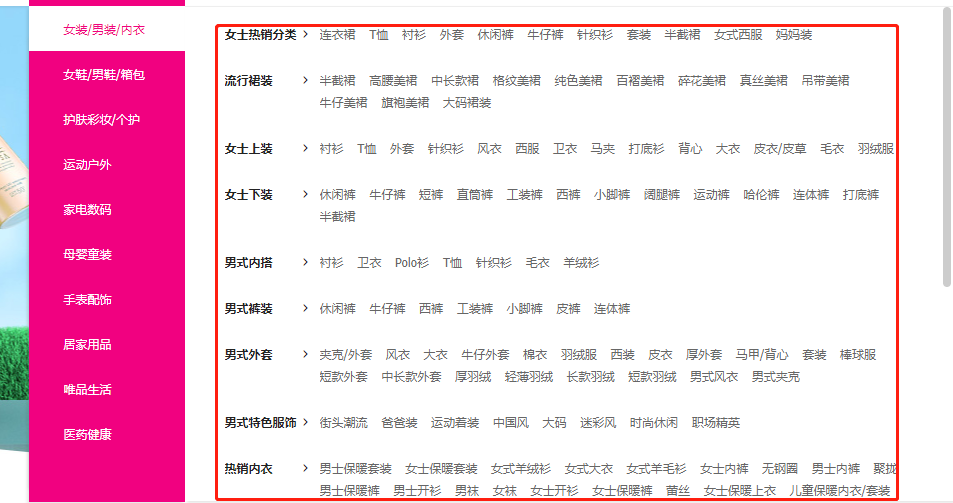

把鼠标移动下面的类型对应也会出现标签对应的类型

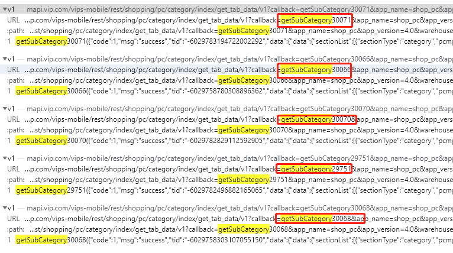

这里往下一滑可以看到确实如此。

这里就那第一个为例子。

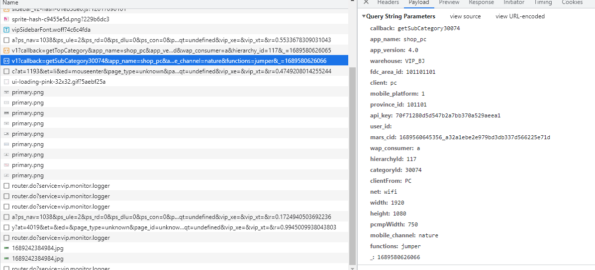

这里还是老参数看起来平平无奇，只有   categoryid 看起来有必要：

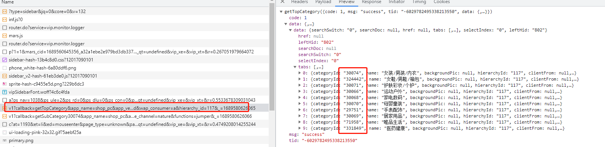

这里可以拿到全品类的id

### 总结

1.先获取全类别接口

2.通过类别接口可以得到，分类的详细 **categoryId** 

3.通过详细  **categoryId**  进行请求 getProductIdsListRank 来获取对应类别的 **productId**

4.通过 **productIds**  获取对应产品的详细信息。

唯品会，整体不复杂感觉没有难解决的难点，就是流程稍微长了一点，一步跟着一步。

进行代码实现后展示成果。

这里拿了10页连衣裙的数据，没任何问题，

<u>**注意不要频繁访问他人网站**</u>

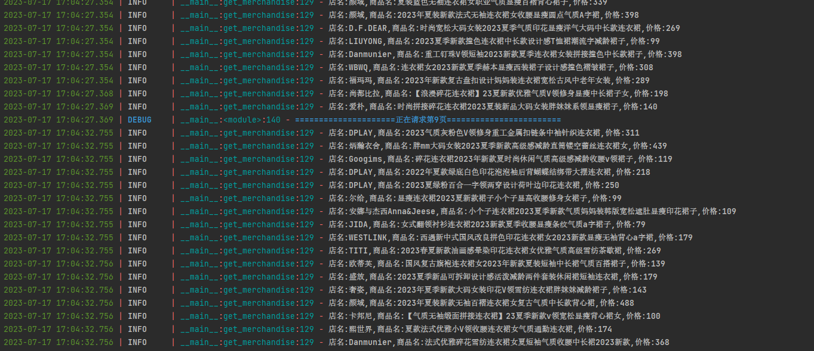

