# 大众点评登录

> 网站地址： aHR0cHM6Ly9hY2NvdW50LmRpYW5waW5nLmNvbS9wY2xvZ2lu  
>
> https://github.com/Guapisansan/gpss_learn_reverse 代码在这里，会持续更新逆向案例

**免责声明： 此文档，以及脚本，仅用来对技术的学习与探讨，如有冒犯，请联系作者电话，微信13933566015进行删除**

逆向登录一下这个登录接口

## 流程分析

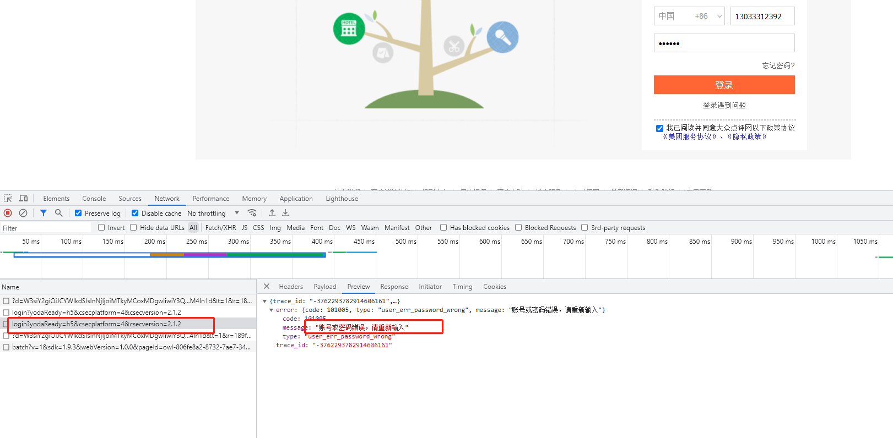

随便输入一个手机号和密码，查看一下接口

接口参数有

**encryptMobile:**  加密手机号

**countryCode**: 地区代码

**encryptPassword:** 加密密码

**uuid**：189f6f7eab4c8-03b0f9301ae80c-26031c51-1fa400-189f6f7eab4c8

**cx:** cxcxcx

**setCookie:** true

**platform:** 1

**siteType:** PC

**h5_fingerprint:** h5指纹

这里需要解决的因该是

手机号，密码，h5指纹

## 手机号，密码加密

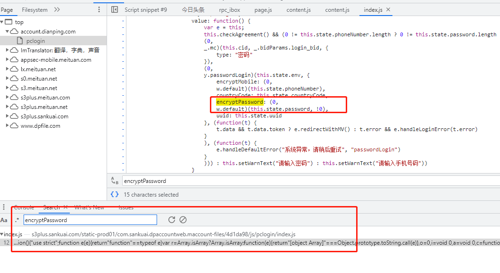

搜索一波密码，定位到位置下个断点，一探究竟

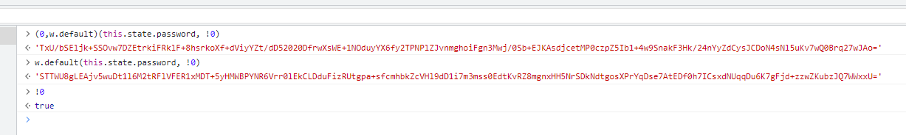

发现加密入口是w.default 

上面也有手机号的加密

手机号加密比密码加密少了一个参数 !0也就是true

跟进函数内部看看

一个比较明显的RSA加密

通过 t ? o.setPublicKey(r) : o.setPublicKey(n), 来控制传入的公钥

两把公钥分别对密码和手机号进行加密

实现一下RSA

这次用webpack打包实现

跟进去抠出来

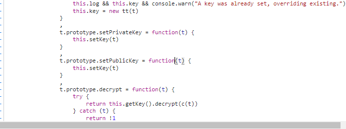

复制到编辑器

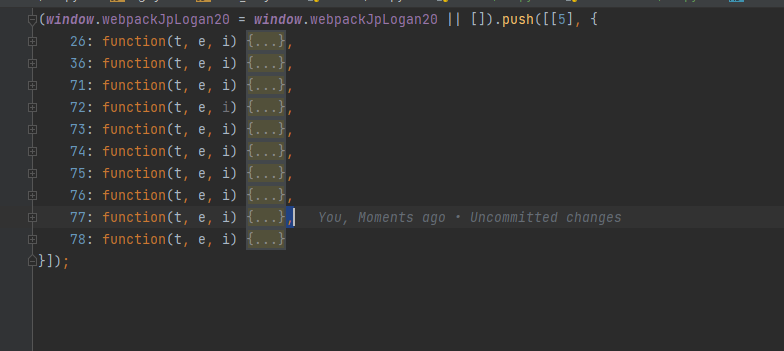

搜一下关键词

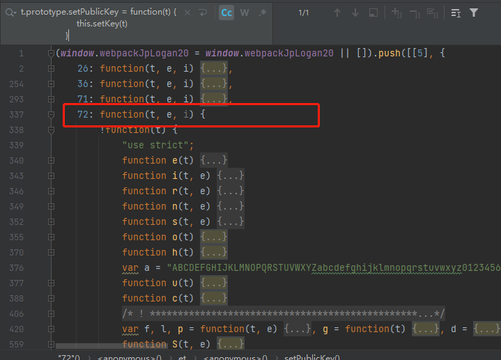

把72拿下来就可以其他的可以先不要

在找到加载器

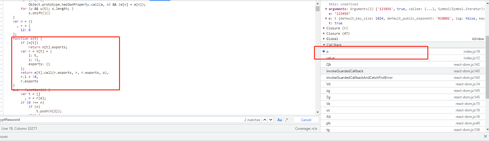

在index文件再熟悉不过了

往加载器套上一个自执行函数，将72对象函数放进去

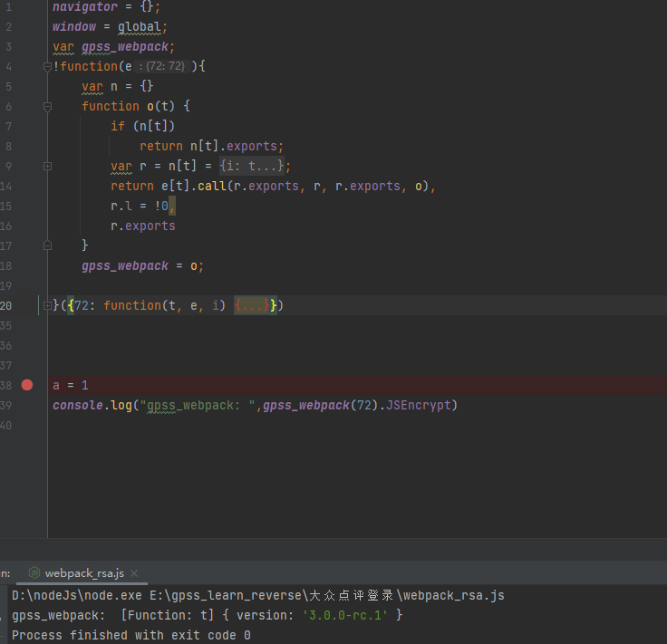

方法被搞出来了，现在来封装一下吧

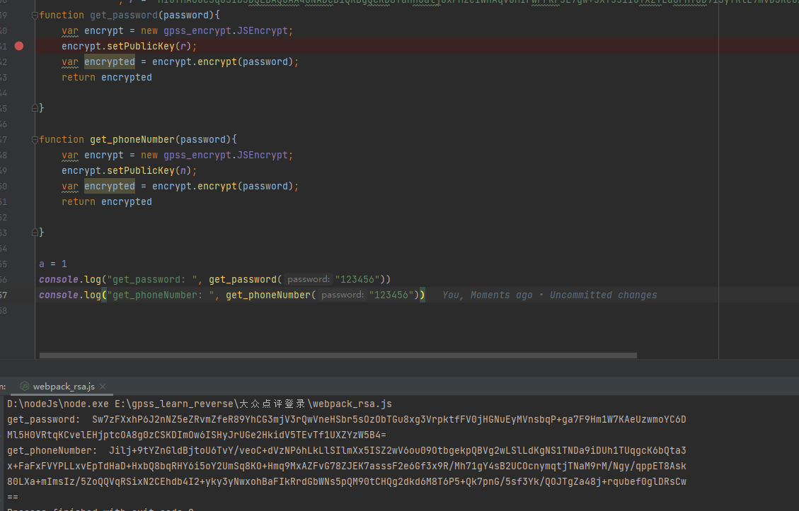

通过webpack打包的方式把rsa方法提出啦

可以看见两段确实不一样明显公钥不同

## h5指纹

全局搜索h5_fingerprint,打一个断点

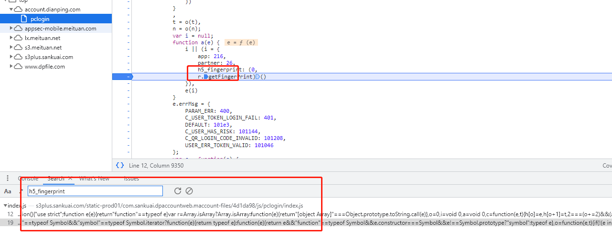

跟进方法里面来

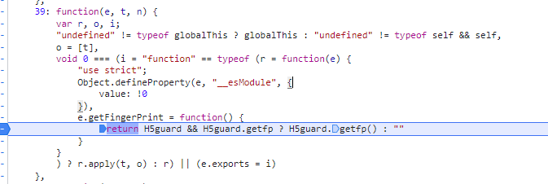

把这个方法抠出来，放到webpack加载器里面