# 天安保险登录

> 网站地址： aHR0cHM6Ly90aWFuYXcuOTU1MDUuY24vdGFjcGMvIy9sb2dpbg==  
>
> https://github.com/Guapisansan/gpss_learn_reverse 代码在这里，会持续更新逆向案例

**免责声明： 此文档，以及脚本，仅用来对技术的学习与探讨，如有冒犯，请联系作者电话，微信13933566015进行删除**

## 查看接口

用手机号注册完之后，可以使用手机号＋密码登录

随便给一个用户名和密码，tacpc/tiananapp/customer_login/taPcLogin  **返回了用户未注册**。

是登录接口看一下里面的参数和响应

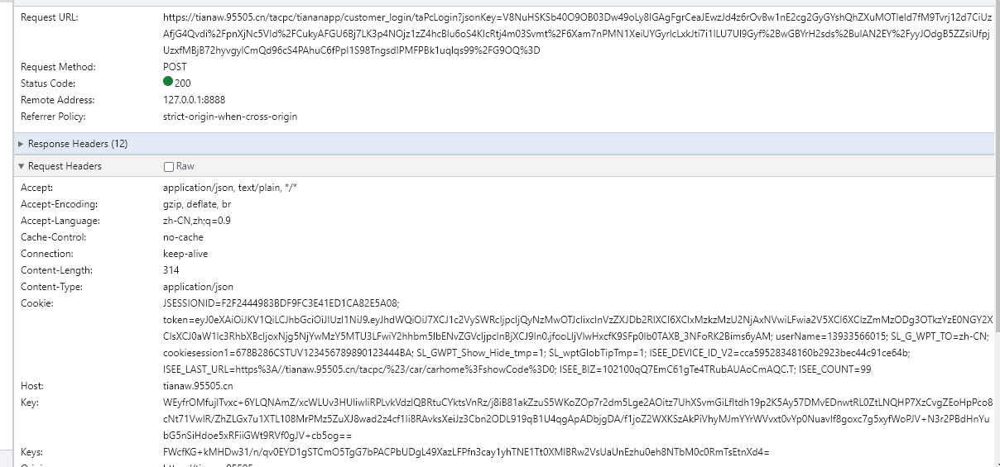

这里是一个post请求，注意的是**headers里面有明显的加密参数key**

请求参数为：

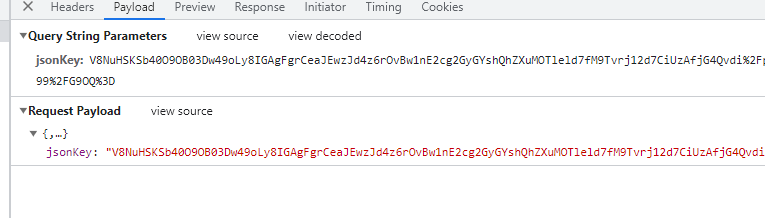

有两个参数，query和payload都有，但是jsonkey相同的，再看响应

响应也是密文的，

先模拟一下请求吧，测试一下参数和取除多余headers。

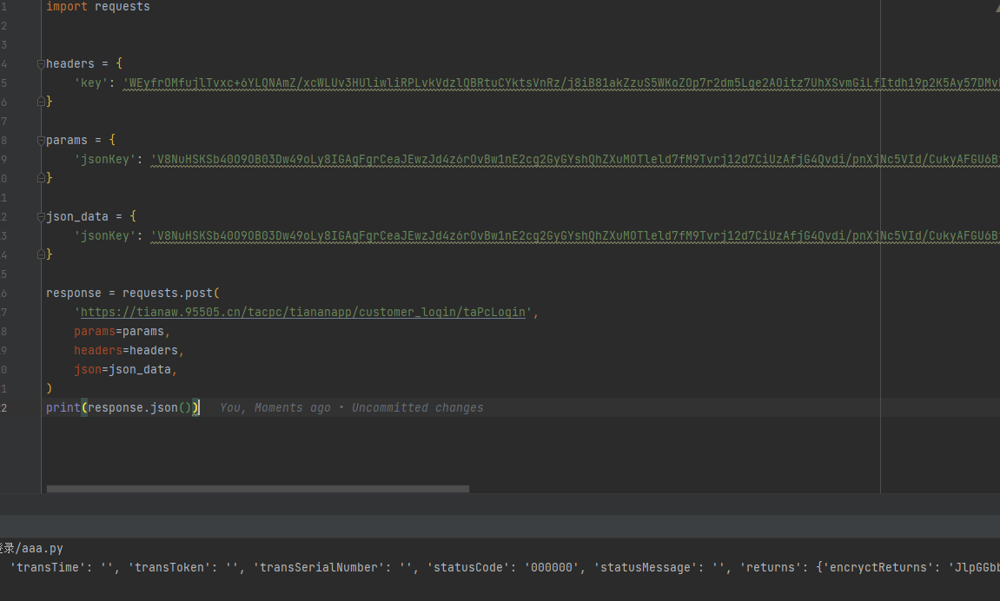

这里经过测试，cookie以及headers里面的其他参数都可以去掉     **如果把key注释了会出现下面这样的情况**

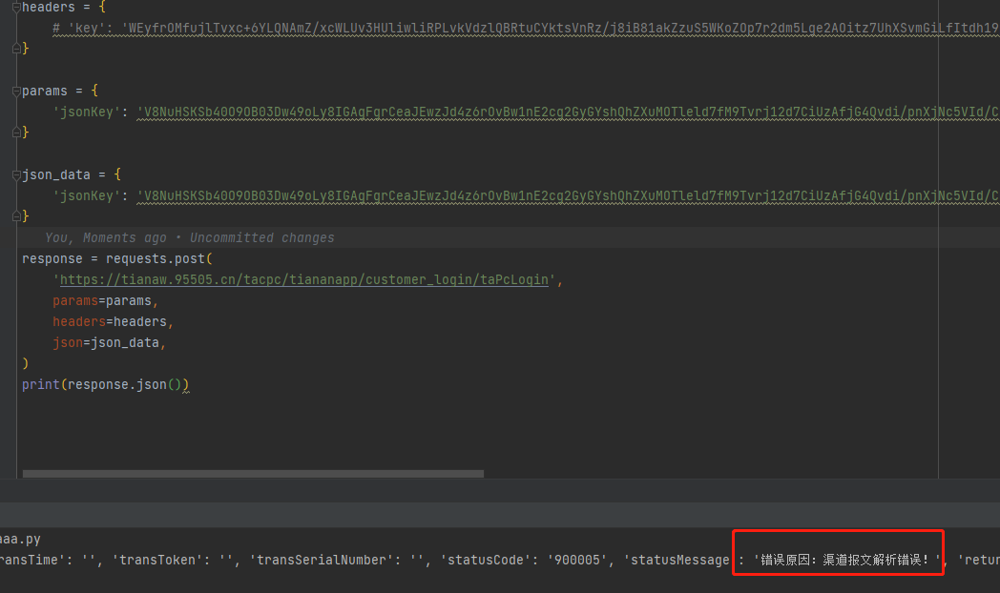

所以重点就是参数的加密和headers里面的key。当然响应的加密最好也要搞定，不如确认不了是否成功。

## 逆向分析

### 请求参数jsonkey

先看一下jsonkey这个参数怎么来的，还是先全局搜索。

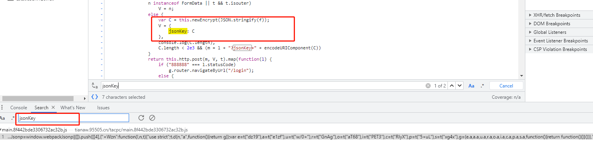

jsonkey就是C，这里有C的加密，直接下断点。

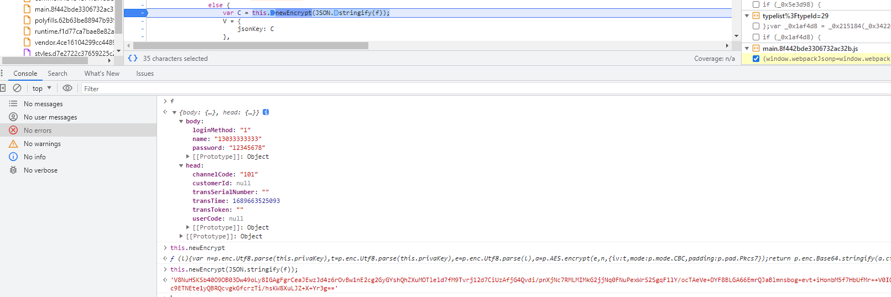

可以看出来 f 包含我们的参数，用户名，密码，head里面包含了一些字段，

this.newEncrypt 就是加密函数，先将 f 对象转为json 在放入加密函数执行即可，就可以得到入参。

进入加密函数可以看出来这是一个AES对称加密，后面用 crypto-js即可实现，

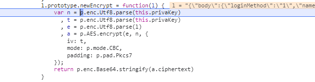

~~~javascript
function aes_encryt(l) {
    l = JSON.stringify(l)
    var n = CryptoJS.enc.Utf8.parse(this.privaKey)
      , t = CryptoJS.enc.Utf8.parse(this.privaKey)
      , e = CryptoJS.enc.Utf8.parse(l)
      , a = CryptoJS.AES.encrypt(e, n, {
        iv: t,
        mode: CryptoJS.mode.CBC,
        padding: CryptoJS.pad.Pkcs7
    });
    return CryptoJS.enc.Base64.stringify(a.ciphertext)
}
~~~

这里的 this.privakey

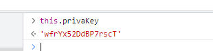

私钥是一个密文，搜一下怎么生成的。

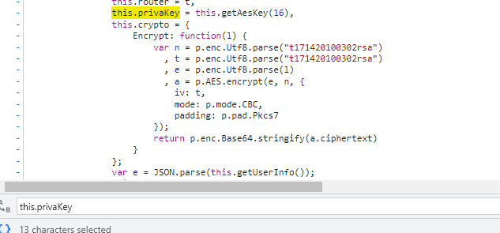

来自this.getAesKey(16)，直接跟过去看一下这个函数内容

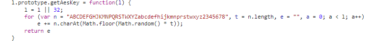

显而易见这里是    **随机生成的16字符串** 

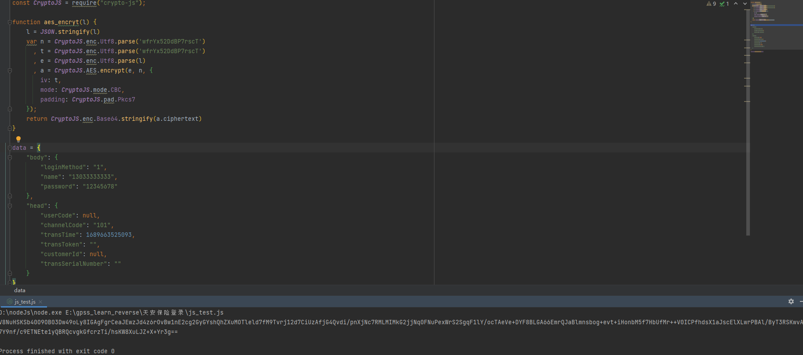

这样就可以得到加密的参数了jsonkey。

这里知道了参数加密，模拟请求，试一试吧

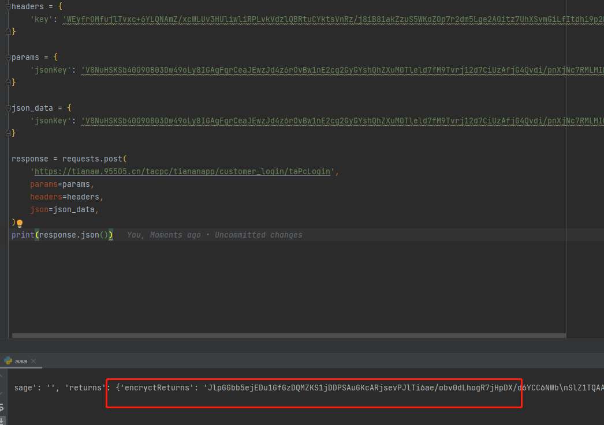

发现响应咱也看不懂，看来还要把响应解密出来。

### 响应解密 encryctReturns

试着搜索 encryctReturns关键字

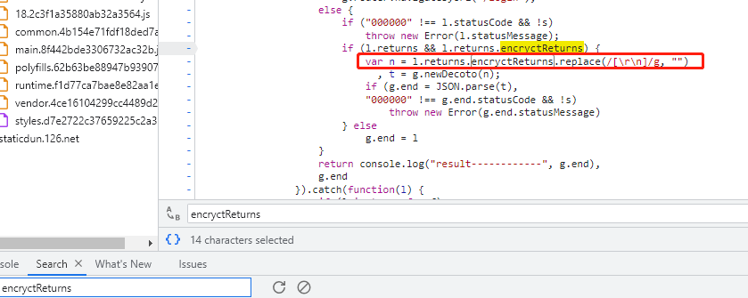

直接下断点，

可以看出这this.http.post是个post请求，然后返回了 encryctReturns 在替换了控制字符，再通过进行解密。

看一下g.newDecoto 怎么做的。

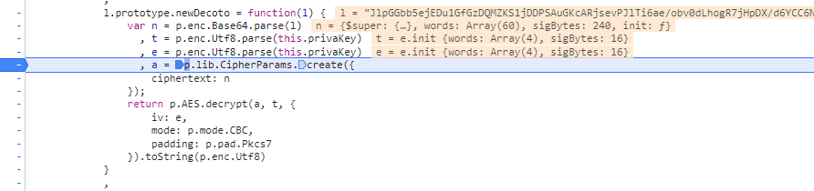

也很简单是一个AES的解密，还是可以用 crypto-js 实现

~~~javascript
function aes_decryt(l) {
    l = l.replace(/[\r\n]/g, "")
    var n = CryptoJS.enc.Base64.parse(l)
        , t = CryptoJS.enc.Utf8.parse('wfrYx52DdBP7rscT')
        , e = CryptoJS.enc.Utf8.parse('wfrYx52DdBP7rscT')
        , a = CryptoJS.lib.CipherParams.create({
            ciphertext: n
    });
    return CryptoJS.AES.decrypt(a, t, {
        iv: e,
        mode: CryptoJS.mode.CBC,
        padding: CryptoJS.pad.Pkcs7
    }).toString(CryptoJS.enc.Utf8)

}
~~~

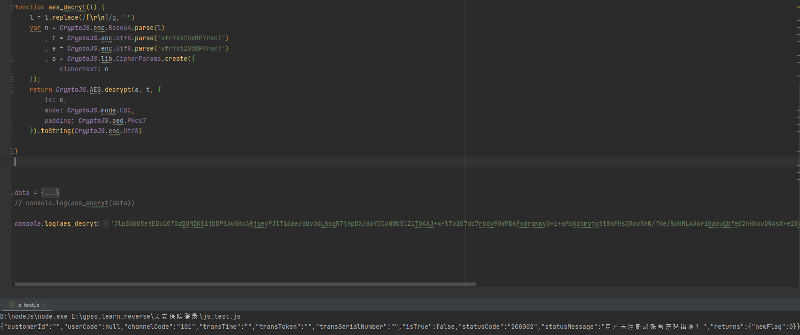

成功解密，现在可以把流程串起来了。这里将login_data作为参数传入函数，

通过AES加密得到请求参数，并将放回的结果进行AES解密。

此时我们还需要解决的就是，key和privakey

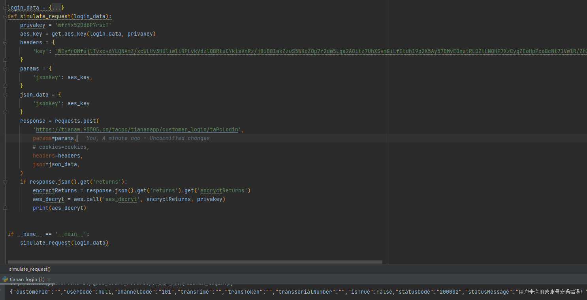

### headers中的key

还是直接全局搜这次不搜key，搜headers因为key大概率有很多，这里可以看出在this.tokens中有key和keys，直接下断点。

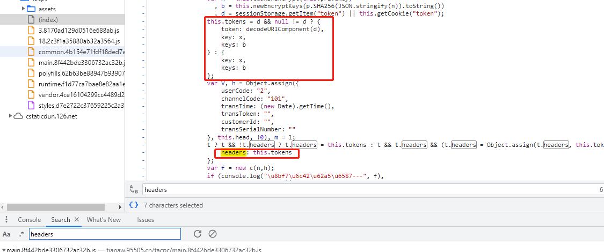

x就是我们要找的key， 它由 this.cmdRSAEncrypt 生成

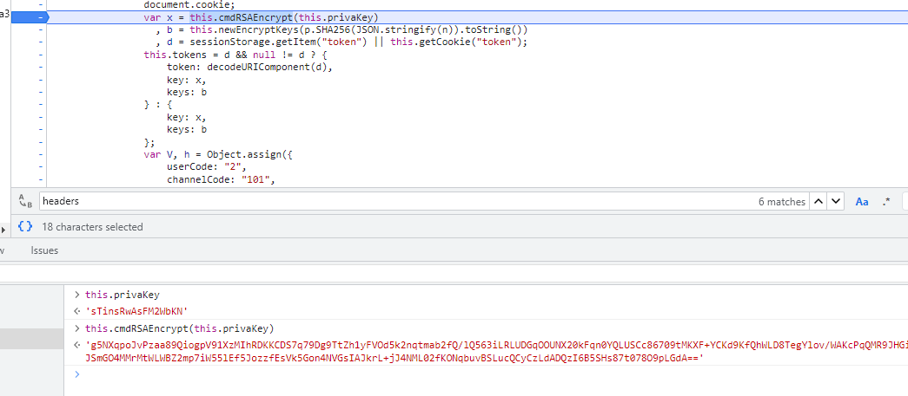

跟进去看看，看函数名可以看出是一个RSA非对称加密，参数是this.privakey，里面还有rsa的公钥。

 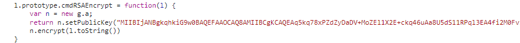

实现一下RSA加密将公钥替换一下就可以了，由于代码比较长就不贴这里了。直接看结果

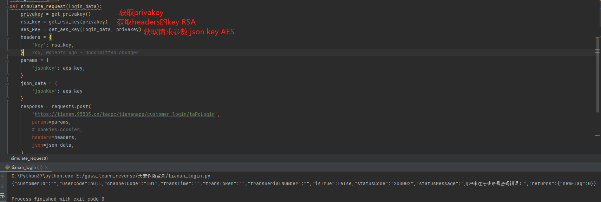

这里要注意的就是全程的privakey必须要保持一致，rsa的加密参数和aes的私钥必须一致

这里将privakey写成灵活的参数传递

### 获取privakey

这里把this.privakey建议用 参数方式传入加解密当中，因为总不能一直写死吧。

将生成privakey的代码直接扣下来就行

~~~~javascript
getAesKey = function(l) {
                l = l || 32;
                for (var n = "ABCDEFGHJKMNPQRSTWXYZabcdefhijkmnprstwxyz2345678", t = n.length, e = "", a = 0; a < l; a++)
                    e += n.charAt(Math.floor(Math.random() * t));
                return e
            }
~~~~

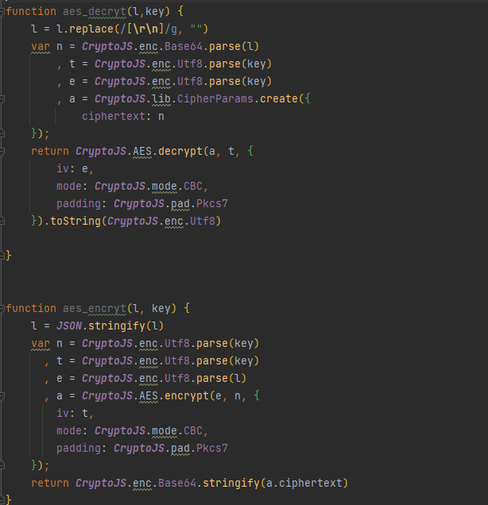

将key作为参数，传入加解密方法当中。

实现一下流程。

## 总结

这个站登录用了，AES,RSA加密，是一种正常的保密手段，

参数都可以直接搜到，没有对JS代码进行混淆。

**注意不要频繁访问他人网站对其进行影响**

换一下正确的用户名和密码看一下结果。返回了正确的信息。

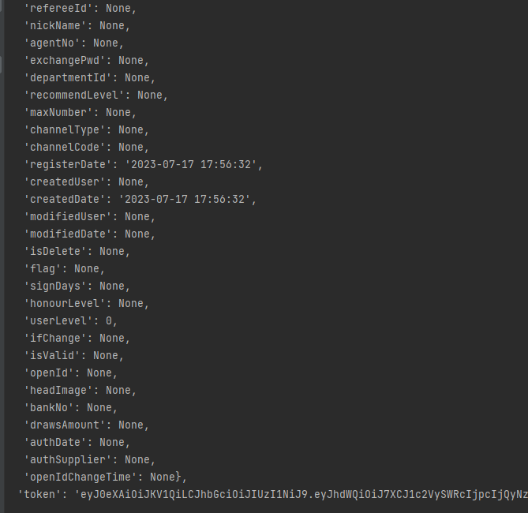