# 央视新闻

> 网站地址： aHR0cHM6Ly9jb250ZW50LXN0YXRpYy5jY3R2bmV3cy5jY3R2LmNvbS9zbm93LWJvb2svaW5kZXguaHRtbD9pdGVtX2lkPTExMTY0Nzk4OTQ4NTcyMzA2ODMwJnRvY19zdHlsZV9pZD1mZWVkc19kZWZhdWx0
>
> https://github.com/Guapisansan/gpss_learn_reverse 代码在这里，会持续更新逆向案例

**免责声明： 此文档，以及脚本，仅用来对技术的学习与探讨，如有冒犯，请联系作者电话，微信13933566015进行删除**

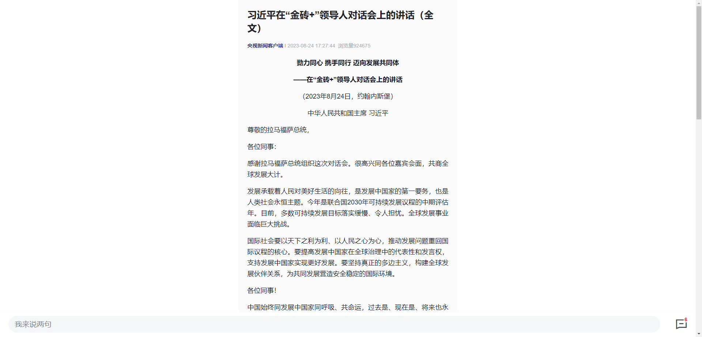

来获取一下这个文章信息。

## 分析流程

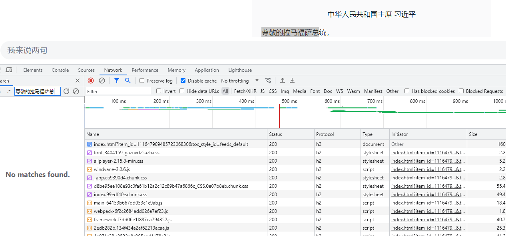

先尝试进行通过关键字搜索接口。

发现没有搜到。。。。。

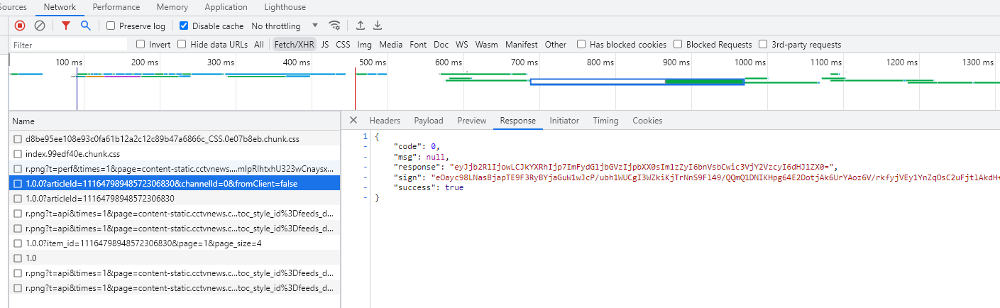

翻了翻接口也没有明文信息，

这个接口的resposne是加密的

怀疑在这里。尝试进行解密

### 解密response

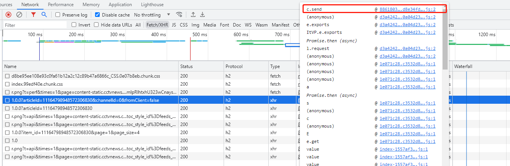

直接在堆栈最后下断点。刷新页面

翻一番堆栈。

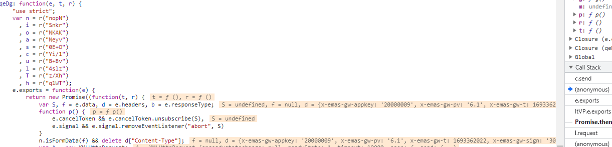

来到这里，

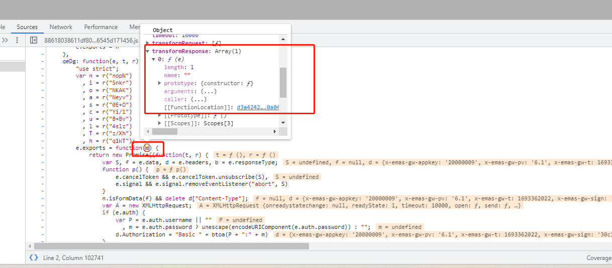

这个地方有一个transformResponse，

引起了我的注意。

进去看看呢

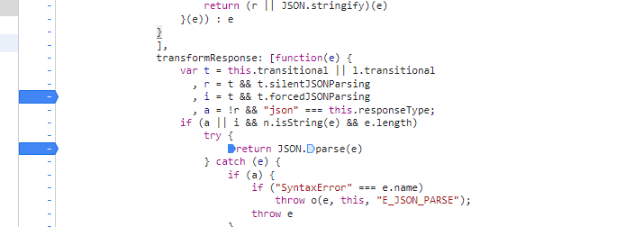

这里下个断点，

确实发现了我们想要的加密信息，

继续找解密信息

还是向上翻

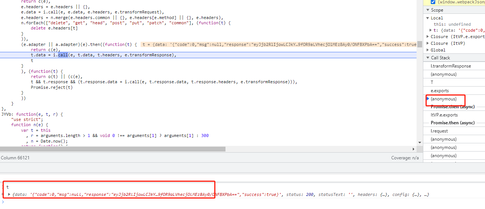

到这个堆栈还是看见了加密后的，继续翻。

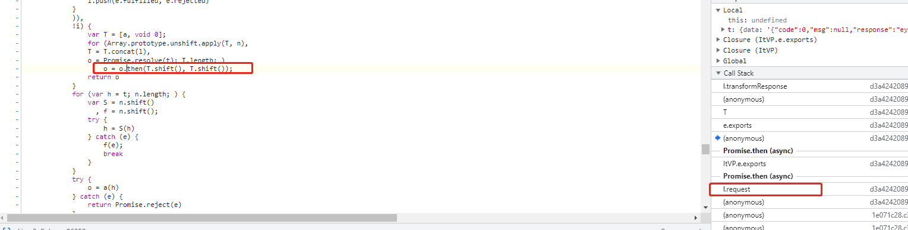

来到这里发现，这个地方大概率会有我们想要的

下一个断点

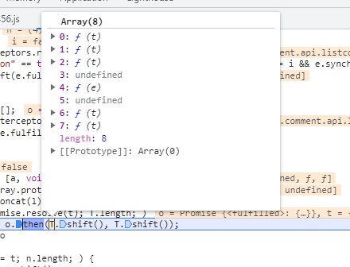

逐个进去看这里面的方法，

找你觉得像的地方打断点

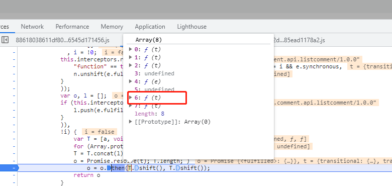

我觉得这个6

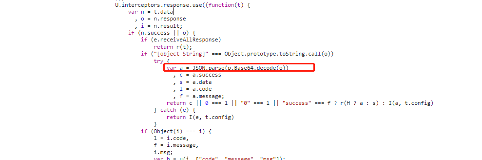

这个地方下一个断点吧，更过来看看呢

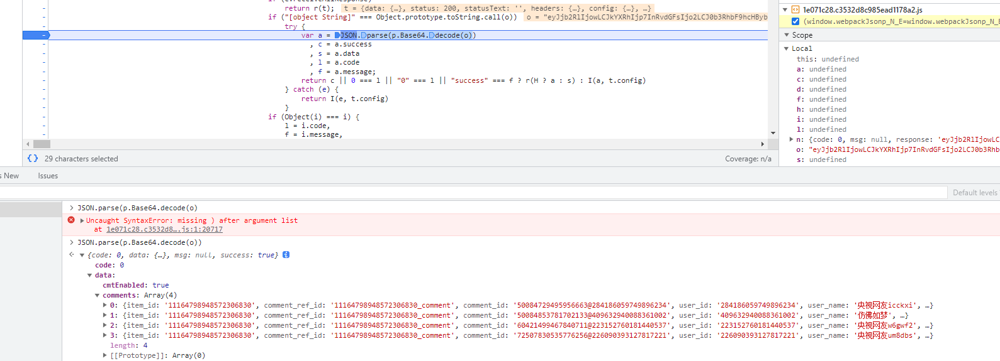

这里发现了确实可以解开，

看着就是一个base64的。

先用python试一下吧

这里随便从网上找个方法

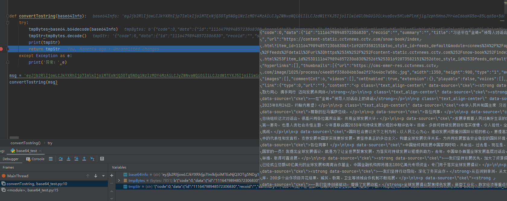

~~~python
def convertTostring(base64Info):
    try:
        tmpBytes=base64.b64decode(base64Info)
        tmpStr=tmpBytes.decode()
        print(tmpStr)
        return tmpStr
    except Exception as e:
        print('异常：',e)
~~~

发现没问题，然后

解密就拿到了。

在看看接口能不能重放，和参数的问题

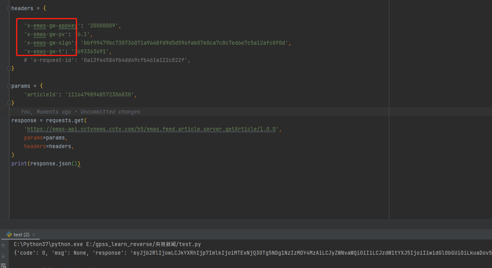

发现这里header有进行校验。

所以这4个参数我也必须拿下来。

### header参数

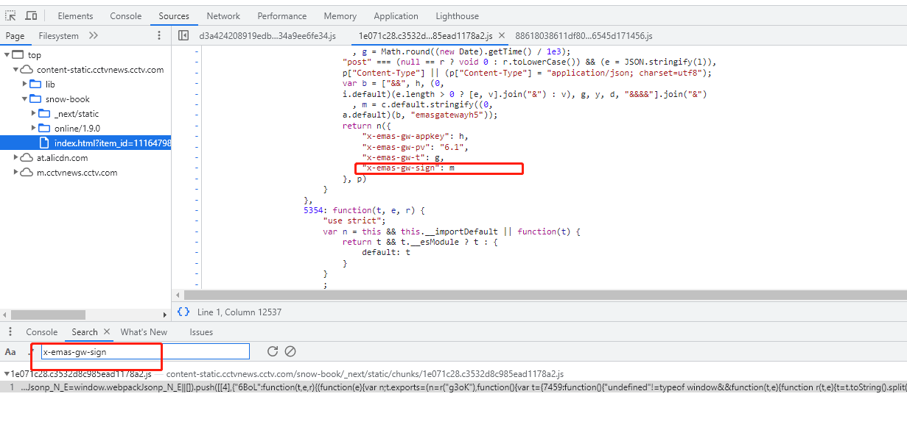

这里很轻松定位到这个headers

下断点。 逐一进行分析吧，

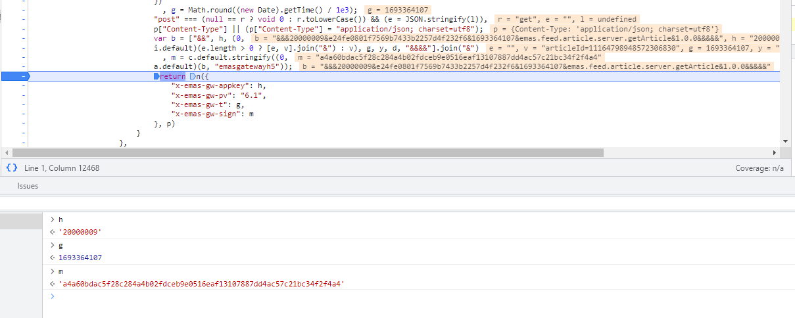

这里的h是20000009 因该就是写死的

g是来自于

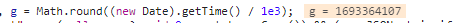

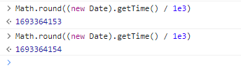

然后看m

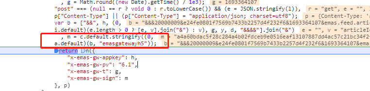

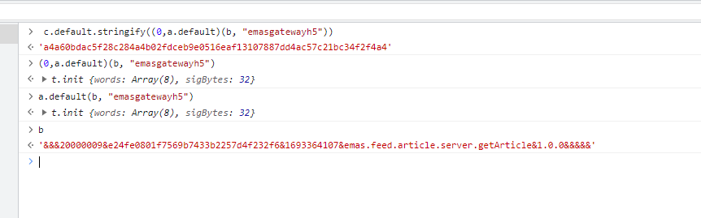

发现这个是一个加密

进去看a.default这个

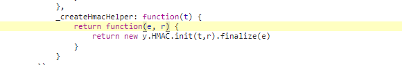

发现是要给HMAC的加密，我也没接触过，

百度一下

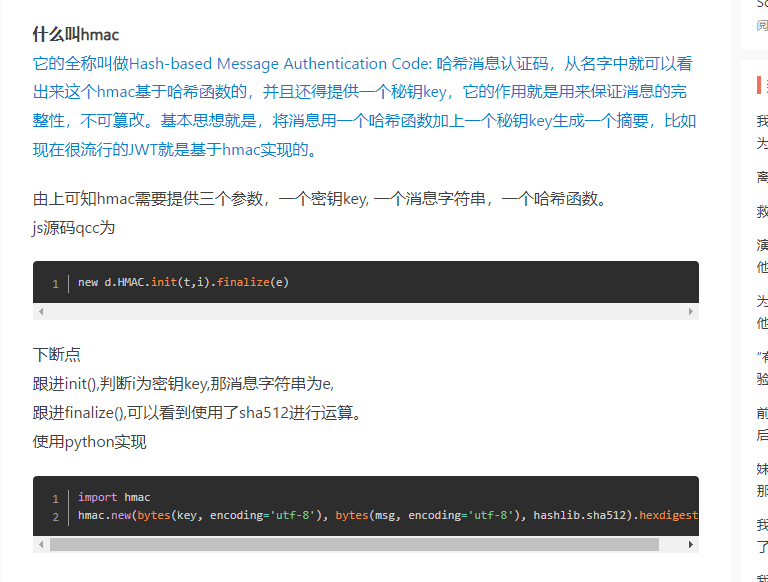

人家说的很清楚了，是一个哈希消息认证码 jwt也是基于这个的

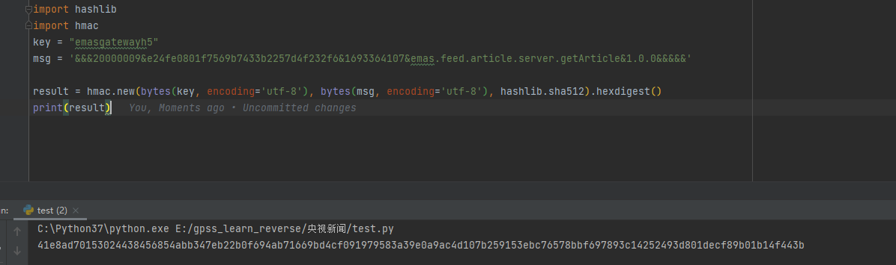

这里能拿到结果拉

但是页面的短，因该是sha256，改成256试试

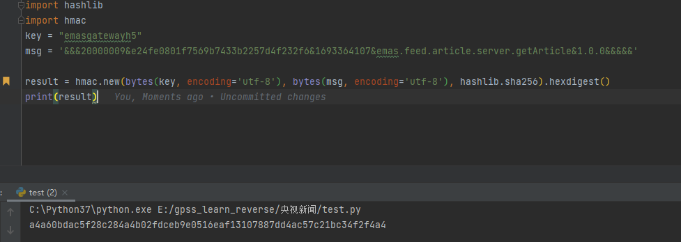

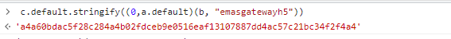

这次和页面的一样了。

这个header的加密就完成了，再找一下这个 msg的来源

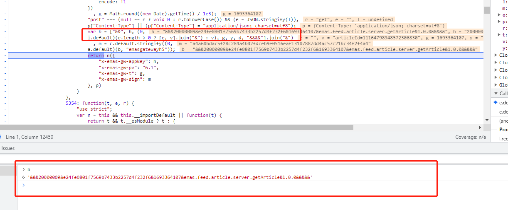

这个b是这样的逻辑

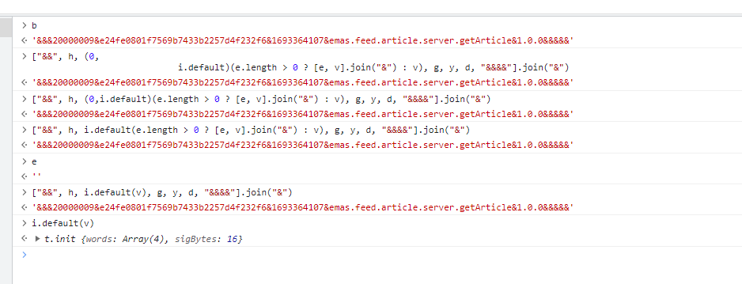

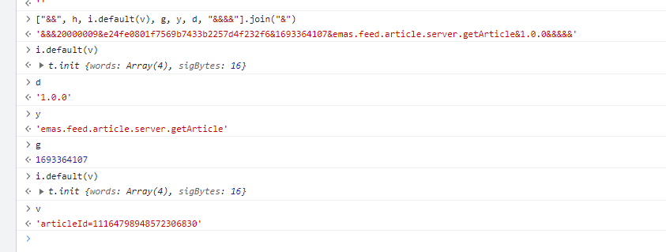

是一个数组然后进行join，

里面i.default是文章id然后进行md5的

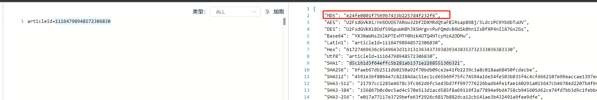

这样一来所有的问题都搞定了。

文章id，加时间戳是不固定的。

实现一些headers吧

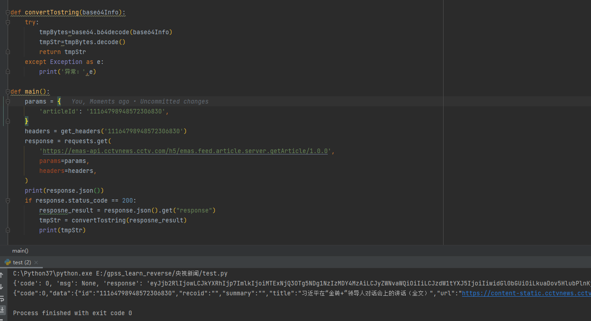

这里将整个流程串起来，成功拿下

嘻嘻嘻嘻嘻

# 总结

没有混淆，比较简单。

里面要解决的问题一共两处。

一个解密响应，一个headers

里面有 HMAC是以前没遇到过的，不过也很好解决
